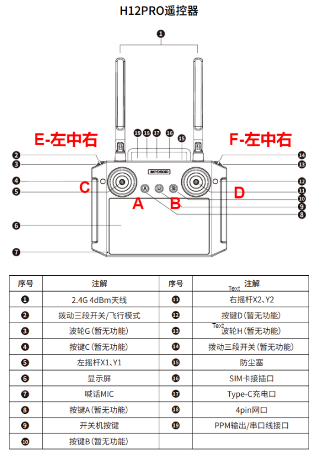

---

# 🤖 Kuavo人形机器人：H12Pro遥控器实机部署与自定义开发全记录

## 第一章：系统部署与基础环境准备

### 1.1 部署流程

> ⚠️ **注意**: h12pro 遥控器的程序以及机器人程序，vr 程序都会使用部署时的 `ROS_MASTER_URI` 与 `ROS_IP`，请确保部署时的 `ROS_MASTER_URI` 与 `ROS_IP` 正确。确认ROS主从通信正确后再进行部署。

**1.1.1 下位机部署**
执行后，会自动安装依赖，并启动 h12pro 遥控器程序：

```bash
cd /home/lab/kuavo-ros-opensource
cd /home/lab/kuavo-ros-opensource/src/humanoid-control/h12pro_controller_node/scripts
sudo su
./deploy_autostart.sh

```

**1.1.2 上位机部署**
执行后会自动编译功能包，将h12遥控播放语音动作的服务设置为开机自启动并启动。根据终端中的提示选择y或n：

```bash
cd ~/kuavo_ros_application
cd ~/kuavo_ros_application/src/ros_audio/kuavo_audio_player/scripts
./deploy_autostart_h12pro.sh

```

### 1.2 H12PRO 遥控器服务管理

* **`ocs2_h12pro_monitor` 服务**：位于下位机，集成了遥控器节点和监控功能，会根据系统状态自动管理遥控器程序的启停。当用户手动启动机器人程序时，h12pro 遥控器程序会自动下线。
* 开启服务：`sudo systemctl start ocs2_h12pro_monitor.service`
* 关闭服务：`sudo systemctl stop ocs2_h12pro_monitor.service`
* 开机自启动：`sudo systemctl enable ocs2_h12pro_monitor.service`
* 关闭开机自启动：`sudo systemctl disable ocs2_h12pro_monitor.service`
* 查看服务日志：`sudo journalctl -u ocs2_h12pro_monitor.service -f`


* **`start_h12pro_play_node` 服务**：位于上位机，将h12遥控器播放语音的相关服务设置成开机自启动。

### 1.3 查看日志与检查数据

* **查看机器人程序运行 LOG**：
```bash
sudo su
tmux attach -t humanoid_robot

```


* **检查遥控器数据是否正常**：
```bash
cd /home/lab/kuavo-ros-opensource
source devel/setup.bash
rostopic echo /h12pro_channel

```


### 1.4 ⚠️ 部署注意事项与踩坑排查（实战经验）

1. **服务抢占机制**：由于 `ocs2_h12pro_monitor` 服务 priority 比较低，如果用户**手动启动** `roslaunch humanoid_controllers load_kuavo_real.launch` 程序时，`ocs2_h12pro_node` 程序将会自动下线，直到用户结束机器人程序后，`ocs2_h12pro_node` 程序才会自动重新上线。
2. **坑1：僵尸进程导致遥控器“装死”**：存在可能用户结束机器人程序后，`ocs2_h12pro_node` 仍然没有上线或者没响应。这通常是因为上一次的节点变成了僵尸进程。请先 `pkill ros` 或者 `sudo pkill ros` 结束所有 ros 进程后，再重新启动 `sudo systemctl restart ocs2_h12pro_monitor.service` 服务。
3. **硬件热插拔**：如果使用的是遥控器外接模块(一个接着遥控器接收器的 **USB 的设备**)去接收遥控器的数据，请在机器人上电后大概20-30秒后，再将外接模块插到机器人上。如果重启机器人 NUC 后，遥控器数据无法正常接收，请热插拔外接模块后再试。
4. **坑2：SSH控制权与遥控器的冲突**：当通过 SSH 运行如 `actions_player.py` 这样的自定义脚本时，如果遥控器摇杆发生漂移，两者的指令会在底层抢占。因此，在通过代码跑自定义动作时，遥控器必须不能动，仅保留急停开关待命。

---

## 第二章：状态机与摇杆控制逻辑

### 2.1 状态机概述

1. **基本状态**：
* `initial`: 初始状态(机器人 NUC 开机， 程序未启动状态)
* `calibrate`: 校准状态(启动机器人程序带上校正参数的状态)
* `ready_stance`: 准备姿态(启动机器人程序后，尚未站立的状态)
* `stance`: 站立姿态
* `walk`: walk 状态
* `vr_remote_control`: VR 遥控器控制状态


2. **状态转换流程**：
*(参考官方图: `robot_state_graph`)*
* 从 initial 状态: `initial_pre` -> ready_stance | `calibrate` -> calibrate
* 从 ready_stance 状态: `ready_stance` -> stance | `stop` -> initial
* 从 stance 状态: `walk` -> walk | `arm_pose1~4` -> stance | `customize_action` -> stance | `stop` -> initial | `start_vr` -> vr_remote_control
* 从 walk 状态: `stance` -> stance | `stop` -> initial


### 2.2 摇杆控制与实战安全 SOP

摇杆支持在 `stance` 和 `walk` 状态下使用：

* **左摇杆**：垂直方向(X轴移动)；水平方向(Y轴移动)
* **右摇杆**：垂直方向(躯干高度控制)；水平方向(旋转控制)

**🚨 紧急停止与“黄金右手”安全SOP**：

* **组合键**: `C_LONG_PRESS + D_LONG_PRESS`
* **适用状态**: 所有状态(除了 initial 状态)
* **安全特性**: **假如在站立状态下触发停止，机器人会先下蹲再停止**。
* **实战经验**：切换强化学习(RL)或跑复杂太极动作时，操作员的右手食指必须时刻搭在紧急停止按钮或断电拨杆上。一旦观察到机器人出现剧烈的不可控高频抖动（如我们遇过的总线通讯延迟导致的自激振荡），直接急停让其软倒，切勿用摇杆强行救车。

---

## 第三章：遥控器按键映射与自定义动作开发

### 3.1 按键示意图与基础状态转换

*(参考官方图: `button_instruction`)*

**【注】**: 遥控器按键组合中，长按(LONG_PRESS)表示按键按下后持续保持按下状态，直到听到遥控器发出 “滴” 的一声。

* **Initial 状态转换**
* `ready_stance` -> `C_PRESS` (开关: E_LEFT + F_RIGHT)
* `calibrate` -> `D_PRESS` (开关: E_LEFT + F_RIGHT)


* **Ready_stance 状态转换**
* `stance` -> `C_PRESS` (开关: E_LEFT + F_RIGHT)
* `initial` -> `C_LONG_PRESS + D_LONG_PRESS` (开关: 任意)


* **Stance 状态转换 (核心控制区)**
* `walk` -> `A_PRESS` (开关: E_MIDDLE + F_MIDDLE)
* `toggle_head_control` -> `B_PRESS` (开关: E_MIDDLE + F_RIGHT)
* **(手臂基础姿态)**：`arm_pose1`~`4` -> `A/B/C/D_PRESS` (开关: E_RIGHT + F_LEFT)


### 3.2 8组自定义动作与语音的配置 (`customize_action`)

在 `Stance` 状态下，系统预留了 8 组 `customize_action` 用于一键播放语音和动作：

* **RR 组（开关置于：E_RIGHT + F_RIGHT）**：
* `customize_action_RR_A` -> `A_PRESS`
* `customize_action_RR_B` -> `B_PRESS`
* `customize_action_RR_C` -> `C_PRESS`
* `customize_action_RR_D` -> `D_PRESS`


* **LL 组（开关置于：E_LEFT + F_LEFT）**：
* `customize_action_LL_A` -> `A_PRESS`
* `customize_action_LL_B` -> `B_PRESS`
* `customize_action_LL_C` -> `C_PRESS`
* `customize_action_LL_D` -> `D_PRESS`


### 3.3 动作文件与音频文件的生成、存储与绑定

这8组动作需要修改下位机配置文件：`/home/lab/kuavo-ros-opensource/src/humanoid-control/h12pro_controller_node/config/customize_config.json`，在其中对应状态填入 `arm_pose_name` (不加后缀) 以及 `music_name` (加后缀)。

**1. 动作文件的生成与存储**

* **生成方式**：分为两种。第一种是通过示教器或上位机动捕软件录制的 `.tact` 动作文件；第二种是像我们排查时使用的 `taiji.json` 轨迹文件，由算法或脚本离线生成。
* **存放路径 (`.tact`文件)**：放到下位机路径 `/home/lab/.config/lejuconfig/action_files` 文件夹中。
* *注：手臂动作做完后，假设手臂没有回到初始位置，可以通过 `E中 + F中 + D键` 将手臂回到初始位置。*

**2. 音频文件的生成与存储**

* **生成方式**：可以使用市面上的任意 TTS（文字转语音）工具，或者在线 AI 语音生成工具，将你想让机器人说的话生成为 `.wav` 或 `.mp3` 格式。
* **存放路径**：
* 若上位机为 `WNUC12WSKI70000`：存放在上位机 `/home/kuavo/.config/lejuconfig/music` 文件夹中。
* 若上位机为 `AGX-Orin/ORIN-NX`：存放在下位机 `/home/lab/.config/lejuconfig/music` 文件夹中。


### 3.4 进阶：使用遥控器直接执行 Python 程序（如打太极脚本）

如果你不想使用系统默认的 `.tact` 播放器，而是想运行我们自己写的、带有时间补偿和姿态控制的 `actions_player.py` 脚本，可以利用配置文件的 `shell` 功能。

按以下方式修改 `customize_config.json`：

```json
  "customize_action_LL_A": {
    "type": "shell",
    "command": "python3 /home/lab/.../actions_player.py"
  }

```

* **工作流**：将遥控器拨到 `E_LEFT + F_LEFT`，按下 `A` 键，系统会在后台起一个进程直接执行我们的太极脚本。
* **注意**：修改完 JSON 配置文件后，**需要关机重启机器人**才能生效。

---

## 第四章：VR遥控与数据录制

### 4.1 VR 状态转换逻辑

* `start_vr_remote_control` -> `A_LONG_PRESS` (开关: 任意)
* **注意**：进入 VR 遥控遥操作状态后，遥控器将不再响应遥控器按键组合（除了紧急停止按键组合和退出 VR 遥控遥操作按键组合），直到退出 VR 遥控遥操作状态。
* 退出/录制操作：
* 退出 VR -> `B_LONG_PRESS`
* 开始录制 ROSBAG -> `C_PRESS`
* 停止录制 ROSBAG -> `D_PRESS`


### 4.2 VR 数据录制话题与路径

* **存储路径**：VR 录制的 rosbag 文件存放在 `~/.log/vr_remote_control/rosbag` 路径下, 按照日期和时间命名。
* **话题配置文件**：`/home/lab/kuavo-ros-opensource/src/humanoid-control/h12pro_controller_node/config/record_topics.json`
* **默认指定录制的话题**：
* `/kuavo_arm_traj` (手臂关节值)
* `/control_robot_hand_position` (手指)
* `/robot_head_motion_data` (头部)
* **深度相机**：
* `/camera/depth/image_rect_raw` (深度相机图像)
* `/camera/depth/camera_info` (深度相机内参，出厂前已标定)
* `/camera/depth/color/points` (带有深度的RGB点云 Point2D)


* **RGB相机**：
* `/camera/color/image_raw` (RGB图像)
* `/camera/color/camera_info` (RGB相机内参)


* **深度对齐RGB相机**：
* `/camera/aligned_depth_to_color/image_raw` (深度对齐RGB后的深度图像)
* `/camera/aligned_depth_to_color/camera_info` (相机内参)