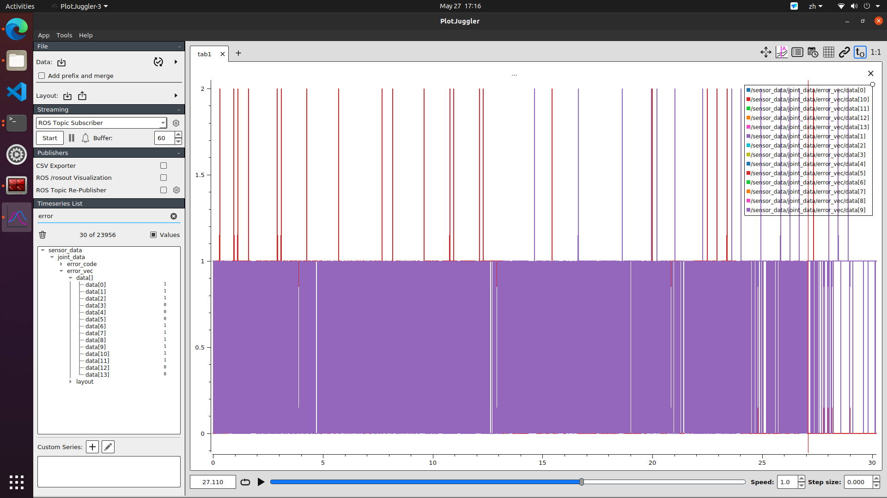
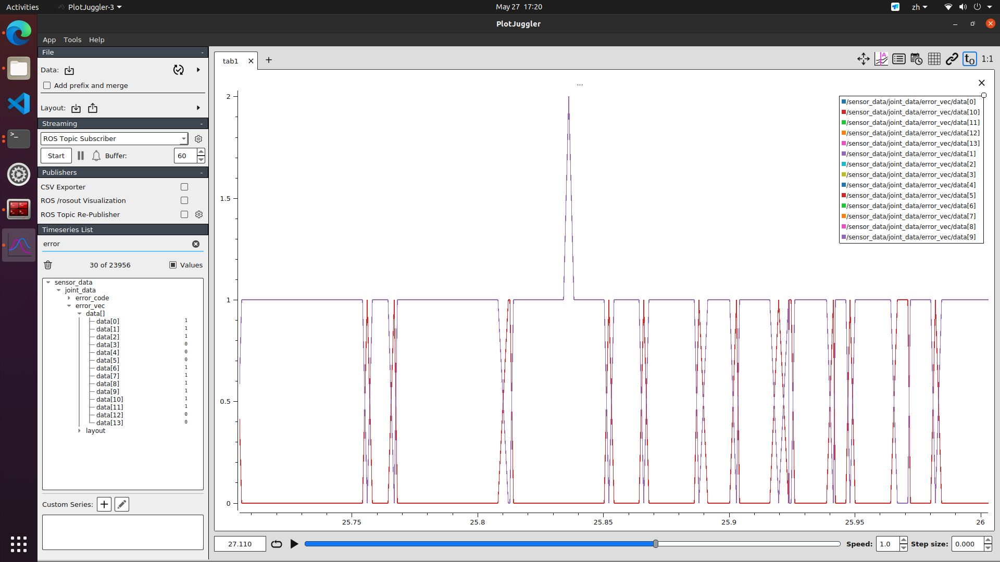
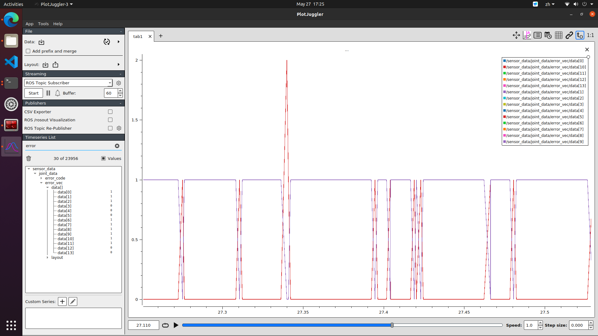
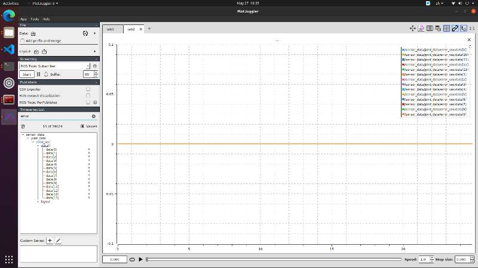

---

# 🤖 Kuavo 人形机器人实机部署与故障排查全记录

**主题**：控制算法调优、仿真崩溃深挖与硬件总线排查

**场景**：太极动作动态部署、底盘 MPC/WBC 稳定性分析、EtherCAT 通信故障诊断与高压演示现场救场。

---

## 第一章：太极动作播放原理与“时间放缩”仿真崩溃深挖

### 1.1 Python 动作播放脚本（actions_player.py）控制原理

在 Kuavo 人形机器人的上层控制架构中，`actions_player.py` 扮演着“轨迹插值与发布器”的角色。其核心逻辑是通过解析离线生成的包含关键帧的 `taiji.json` 文件，并将其转化为底层控制算法能够接收的高频连续轨迹数据。

#### 1.1.1 JSON 轨迹解析与时间轴同步逻辑

* **数据结构**：`taiji.json` 内部包含两大核心数组——`step_control`（控制足部步态与躯干姿态）和 `arm_motion`（控制双臂各关节角度）。
* **足部与躯干轨迹生成**：在 `generate_foot_trajectory` 函数中，脚本遍历 `step_control` 数组，通过累加每个阶段的 `step['time']` 来构建连续的时间轴 `msg.timeTrajectory`。同步将各个阶段的支撑模式（双脚支撑 `SS` 映射为 `2`、左脚支撑 `SF` 映射为 `1`、右脚支撑 `FS` 映射为 `0`）和对应的躯干、脚部位姿填入 `footPoseTargetTrajectories` 消息中。
* **双臂轨迹生成**：在 `generate_arm_trajectory` 函数中，脚本以步态触发时间为基准，同样累加 `motion['time']` 构建时间轴，并将角度转化为弧度值填入 `armTargetPoses` 消息中。
* **时间同步对齐**：为了保证机器人运动时“手脚协调”，足部轨迹的时间累加轴与双臂轨迹的时间轴必须在数学上严格保持严格的比例与对齐，否则会导致质心规划（CoM Planning）与上肢动量补偿错位。

#### 1.1.2 ROS 节点话题下发与控制模式切换

* **控制权接管**：在脚本执行动作前，必须首先调用远程 ROS 服务 `/humanoid_change_arm_ctrl_mode`，下发模式代码 `2`，从而将双臂由默认的内部轨迹控制模式成功切换为**手臂外部控制模式**。
* **状态同步机制**：脚本通过订阅 `/humanoid_mpc_observation` 实时获取当前的 MPC 时间 `mpc_time`；同时订阅 `/humanoid_mpc_gait_time_name` 捕获自定义步态的动态触发时间 `gait_start_time`。
* **协同发布**：只有当 `mpc_time` 严格达到或超过底层的步态启动时间后，脚本才会向 `/humanoid_mpc_foot_pose_target_trajectories` 和 `/kuavo_arm_target_poses` 话题同时高频打入目标轨迹数据，最终驱动底层的全身控制（WBC）执行机构。

---

### 1.2 第一版“软件降速”策略踩坑（失败方案）

#### 1.2.1 尝试方案：引入 `TIME_SCALE` 全局放慢动作

由于在真机测试中怀疑底层存在高频丢包和指令数据饥饿，最初尝试在 `actions_player.py` 的算法层引入一个时间放大系数 `TIME_SCALE = 1.8`。通过在生成足部和手臂轨迹时将持续时间同步乘以 `1.8`，意图拉长动作周期、降低轨迹点的整体下发密度，从而留给底层总线更多的喘息和重传时间。

#### 1.2.2 踩坑表现：MuJoCo 仿真物理节点闪退

该方案在通过命令启动 MuJoCo 仿真测试时发生了严重崩溃：

```bash
$ roslaunch humanoid_controllers load_kuavo_mujoco_sim.launch
...
[ArmTrajNode]: Received arm target poses
================================================================================
REQUIRED process [humanoid_sqp_mpc-4] has died!
process has finished cleanly
log file: /root/.ros/log/.../humanoid_sqp_mpc-4*.log
Initiating shutdown!
================================================================================
```

运行太极程序后，底层的核心 C++ 求解节点 `humanoid_sqp_mpc` 在接收到上层下发的慢速轨迹后，没有做出任何动作便瞬间闪退，并引发整个 ROS 系统联动关停。

---

### 1.3 仿真崩溃根源深度剖析

通过对崩溃前的系统日志进行深度抓包，发现了底层的两个决定性崩溃根源：

#### 1.3.1 物理动力学无解：零动态约束发散

人形机器人在动态运动（如单脚支撑跨步或单腿承重）中，本质上是一个极其不稳定的高度非线性倒立摆系统。底层的 SQP-MPC 求解器是在极短的预测时域（例如 0.5 秒到 1 秒）内，通过二次规划（QP）高频求解机器人在满足摩擦锥、接触力约束下的最优控制序列。
当上层脚本强行将步态时间拉长 1.8 倍时，意味着机器人在物理世界里需要在一个极度违反重力的单脚悬空或倾斜姿态下**维持长达原先 1.8 倍的时间**。底层的 Riccati 矩阵在迭代解算时发现，由于重力矩引起的倾覆动量远远超出了非支撑脚的动量补偿极限，**二次规划（QP）在物理约束内出现了“无解（Infeasible）”的状态**，矩阵解算直接发散，从而在 C++ 层面抛出致命异常导致节点崩溃。

#### 1.3.2 模式序列内存溢出：底层 C++ 数组 Buffer Overflow

从崩溃日志的最后一帧可以清晰地看到：

```text
t[156]:156.81 mode: SS
custom gait start time: 4.51
custom gait end time: 123.31

```

当系统时间轴被强行拉长到 120 秒以上后，底层的 OCS2 预测算法为了在时域内补齐未来的轨迹状态，被迫向后循环生成并推演了多达 157 个步态模式段（Mode Sequence）。而在底层的 C++ 源码中，为了保证高频硬实时的性能，通常会对步态阶段的缓存数组大小（例如 `MAX_PHASE_NUM`）进行固定内存分配（通常上限硬编码为 100 或 150）。当上层塞入的慢速轨迹导致解算出的阶段数突破 150 时，**底层直接触发了内存越界访问（Segmentation Fault）**，核心节点瞬间被系统直接杀死。

---

## 第二章：薛定谔的硬件总线故障：rosbag 数据分析与“犯罪现场”锁定

### 2.1 故障现象更正与误判分析

#### 2.1.1 姿态代偿尝试的失败

在未进行全面数据查包前，直观上曾误判定原版太极动作会导致机器人前倾摔倒，并在代码层尝试通过建立 `self.COM_X_OFFSET = -0.035` 和 `self.COM_Z_OFFSET = -0.020` 的补丁，强行将机器人的躯干质心后移 3.5cm、下沉 2.0cm。但在仿真及真机中测试发现，这种盲目修改质心参数的方法完全是治标不治本，甚至会导致 MPC 求解出的关节力矩更加恶化。

#### 2.1.2 故障现象的精准更正

通过将机器人挂在安全吊架上进行严密的冷机/热机对照实验，最终捕获到了故障的真实外在表现：**机器人并非由于重心不稳而发生结构性倾倒，而是在进入半蹲保持状态时，双腿（尤其是右腿）突然爆发大振幅、高频率的剧烈颤抖（自激振荡），随后由于超出电机电流或位置红线，瞬间触发保护，电机断电软倒。** 

### 2.2 数据抓包与分析工具踩坑（rosbag & PlotJuggler）

为了定位上述高频震荡的真实根源，必须对实机运行产生的底层数据包进行抓包解算。

**【基础操作】启动 PlotJuggler 的终端命令**：
打开一个新的终端（快捷键 `Ctrl + Alt + T`），输入以下两行指令之一即可启动分析软件：

* **通过 ROS 启动（最常用）**：`rosrun plotjuggler plotjuggler`
* **独立安装启动**：`plotjuggler`

在操作分析工具时，暴露出了以下技术问题和规避方案：

#### 2.2.1 自动分包与容量保护机制下的“丢包”谜团

* **现象**：在实验路径下发现短时间内生成了大量的 `.bag` 文件（例如连续生成了 8 个名为 `..._1.bag` 到 `..._8.bag` 的文件），且以前的某些历史测试包找不到了。
* **机制剖析 1（分包）**：这是因为机器人的后台自启录包脚本硬编码了 `--size=500 --split` 的切分参数。人形机器人全身上下数十个话题在 1000Hz 下的爆发式写入，使得**数据积累到 500MB 只需要短短 30~40 秒**。因此只运行了一次起立，就会因为时间跨度而切分出大量包。
* **机制剖析 2（自动清理）**：历史文件消失是因为系统配置了自动容量管理：
```text
* /nodelet_manager/max_log_size_gb: 64.0
* /nodelet_manager/log_delete_limit_gb: 60.0

```


当整个日志目录累积超出 64GB 时，Ubuntu 后台的守护节点会自动以 FIFO（先进先出）的规则静默删除最久远的 `.bag` 包。
* **选包金标准**：寻找目标时间包时，必须将终端运行动作时的 **Unix 时间戳**（如日志打印的 `1779877503` 对应 18点25分03秒）与文件的生成时间做严密区间比对，精确捞取动作发生时正在写入的那个数据分包。

#### 2.2.2 PlotJuggler 内存溢出（OOM）崩溃规避

* **现象**：当试图同时加载多个 500MB 的大容量 `.bag` 文件，或者在追加数据文件时错误点击弹窗警告的选项，导致整个 PlotJuggler 软件瞬间假死、无响应并闪退。
* **底层根源**：PlotJuggler 为了保证时间轴的高流畅度，其底层机制是在加载文件时将高频压缩数据一次性在内存（RAM）中全部解压并展开为连续的浮点型时序数组。一个 500MB 的 bag 包展开后会瞬间吃掉数 GB 的 RAM，多包盲目合并会立刻触发 Linux 系统的 OOM (Out of Memory) 保护机制，直接强杀软件。
* **正确查包 SOP**：
1. **按需过滤加载**：在导入大容量 bag 包时，在话题勾选框中**仅勾选急需分析的单一话题**（如 `/sensor_data/joint_data/error_code`），拒绝加载图像、点云等高带宽话题。
2. **物理进程双开**：若需跨文件严格对比“静态站立基线”与“动态太极曲线”，严禁在同一个窗口内通过点击“No”去无限合并多包，应在系统内打开两个完全独立的 PlotJuggler 进程，进行左右分屏绝对位置肉眼比对。


---

### 2.3 锁定硬件级“犯罪现场”

通过上述过滤查包手法，成功抓取到了系统发生故障时的两项铁证，直接锁定了底层硬件和通信链路的致命缺陷：

#### 2.3.1 铁证 1：基线站立状态下的 error_code 锯齿过山车
PlotJuggler 快速操作指南：启动软件后，直接将目标 .bag 文件拖拽至主界面（或点击左上角 Data -> Load Data 导入）。为了防止大文件卡死，在导入弹窗中仅勾选我们需要的话题；接着在左侧的 Timeseries List 搜索框中输入 error 关键词，展开 /sensor_data/joint_data/error_vec/data[] 结构，全选相关的下肢关节状态码（如 data[9]、data[10] 等），将它们一并拖拽至右侧的空白绘图区，即可生成直观的过山车曲线。

在排查一个“机器人仅执行 Stance 模式起立，完全不跑任何动作脚本”的纯静态 Baseline 包时，在 PlotJuggler 里拉出下肢关节错误向量话题 `/sensor_data/joint_data/error_code/data[]`，发现了极其诡异且惊悚的曲线：


动态数据复盘：曲线清晰地记录了故障的全过程——在机器人运行太极动作节点期间，各个核心下肢关节发生了严重的高频丢包（状态码在 0 与 1 之间密集跳变）。这种底层通信延迟在宏观上直接导致了机器人频繁的低频跟随颤抖以及重心不可控地前倾。当动作进行到约 27.3s 时，总线丢包率彻底突破了底盘 WBC 算法的容错极限，引发了灾难性的高频自激振荡（机体剧烈抽搐）；出于安全考量，我们瞬间按下了物理急停开关强制切断电机动力，因此可以看到曲线在 27.3s 之后骤然中断并彻底跌落归零，录包进程也被迫终止。




正常情况下，机器人静止时该话题的所有关节错误码应该是一条死死贴在 `0` 电平上的完美直线：



但在这份基线包中，全身上下多个核心下肢关节的错误码在 **0 和 1 之间爆发了极高频、密密麻麻的方波跳变（过山车锯齿）**。

* **状态码定义**：`0` 代表通信帧正常；`1` 代表发生了严重的 EtherCAT 通信周期性超时/丢包。
* **物理结论**：这证明机器人底层的中枢通信网络在**空载怠速状态下就已经患了重病**，通信带宽已经被高频的信号丢失和主站疯狂重传挤满。

#### 2.3.2 铁证 2：/rosbag 目录下 ecmaster0.xxx.log 日志井喷

在查看系统存储层时，发现文件夹下除了数据包，在短短几分钟内井喷式吐出了多达上百个名为 `ecmaster0.001.log`、`ecmaster0.002.log` 的底层日志。


* `ecmaster` 是系统的 **EtherCAT Master（主站控制内核）**。在正常通信网络中，主站只会生成一个整体日志。
* 上百个错误日志的出现，意味着主站程序在每隔几秒钟的周期内就遭遇了无法容忍的通信灾难（如 `Datagram Timeout` 数据报文超时、`Working Counter Error` 工作计数器因节点掉线而报错、或分布式时钟 `DC Sync` 彻底丢失）。主站为了自保，在不断强行切断并重开日志。

#### 2.3.3 故障终极定性

结合右腿大腿与膝盖关节（9号、10号电机）的丢包率高居不下的特征，最终完成了故障的技术定性：**这是一起典型的“薛定谔式间歇性物理虚接故障”。由于右腿在半蹲状态下受到特定的机械应力拉扯，导致其内部的高速 EtherCAT 骨干通信排线或航空插头引脚处于临界接触不良状态，引起阻抗匹配失效，信号在传输中发生严重反射，最终导致了严重的 50Hz 周期性高频丢包（通信延迟暴增至 20ms 以上）。**

---

## 第三章：Sim-to-Real 控制层妥协、终极救场方案与起飞前 SOP 检查

### 3.1 震荡根源与控制算法层的“物理妥协”

#### 3.1.1 颤抖的理论分析：高控制增益（Kp）遇上高通信延迟

在机器人正常的 WBC 算法中，为了确保机器人半蹲或起立时能对抗重力，必须给予关节极高的刚度反馈，即在 `/mpc/task.info` 中将下肢关节的位置增益 `joint_kp` 设为高达 **`200`**。

* 在理想通信下（延迟 < 1ms），200 的高增益能提供极强的刚性和稳定性。
* 但是，当底层通信由于上述硬件虚接掉进了 **20ms 的延迟深渊**后，灾难发生了。电机没能及时收到 WBC 发出的微调力矩；等 20ms 后收到时，机体已经由于重力下沉产生了大误差，此时乘以 Kp=200，系统会瞬间计算并输出一个毁灭性的超大矫正扭矩。这导致电机瞬间严重过冲，随即引发反向大误差，周而复始，在宏观上便演变成了**高频剧烈的自激振荡（疯狂发抖）**。

#### 3.1.2 软腿效应复盘：为什么不改轨迹直接运行会前倾与低频微抖？

在演示现场，通过**人工降低控制增益**，将底盘下肢关节的 `kp` 强行下调至 **`120~150`**。

* **前倾趋势的根源**：`kp` 代表了关节的虚拟弹簧刚度。降了 Kp，机器人的腿部支撑在物理上变“软”了。由于本次使用的是纯官方原版轨迹，没有加入重心后移代码，当机器人双臂大角度前伸执行太极动作时，变软的膝盖和脚踝关节力矩克服不了手臂前伸产生的巨大覆倒重力矩，因此身体不可避免地展现出了往前俯冲倾倒的趋势。
* **微抖的根源**：低刚度减弱了关节对复杂 WBC 位置曲线的动态追踪能力，导致关节在运动中始终存在微小的位置滞后和不断修正，表现为了低频的机身柔顺颤动。
* **人机协作机制**：在演示中，**操作员在后方轻扶机器人骨盆所给出的外力，在动力学上恰好完美扮演了缺失的“质心后移代偿力矩”**。外力阻断了前倾的动量累积，从而在低刚度状态下强行护航机器人完成了全套太极动作。

---

### 3.2 演示成功的最终环境与配置清单

在现场高压环境下，最终通过一套软硬件协同的“应急救场补丁”，实现了零 Bug 顺畅演示的最高目标：

#### 3.2.1 代码配置（恢复纯净）

* 放弃所有在上层 Python 时间轴和空间轴上的极端篡改尝试。
* **最终配置**：恢复 100% 干净、原汁原味的**官方原版 `actions_player.py**`，杜绝任何可能导致底层 MPC 求解器产生数学发散或 OCS2 步态序列预测越界溢出的安全隐患。

#### 3.2.2 算法参数配置（降噪去耦）

* **文件路径**：`/root/kuavo_ws/src/humanoid-control/humanoid_controllers/config/kuavo_v42/mpc/task.info`
* **最终配置**：定位到下肢关节配置区，将 `joint_kp_` 和 `joint_kp_walking_` 统一由官方默认的 `200` **下调至 `120` 或 `150**`（根据冷热机状态动态切换），`joint_kd_` 保持在 `8.0 ~ 10.2` 不动。利用软件降刚度的方法，强行吸收和包容底层总线残存的延迟，切断正反馈振荡链条。

#### 3.2.3 物理急救配置（断电降温与机械紧固）

* **物理操作 1（消热）**：由于 EtherCAT 通信芯片与电机驱动总线在高热状态下由于热噪声引起的丢包率会成倍暴增。演示前必须对机器人进行**彻底断电冷机、静置散热 15 分钟**，清空主站内堆积的数十万条报错缓存，利用冷启动建立完美的初始分布式时钟（DC Sync）同步时序。
* **物理操作 2（去虚）**：在冷机状态下，对右腿大腿根部和膝盖关节处的黑色 EtherCAT 通信航空插头进行重新的**强力物理按压并拧死到极致**，强制错开临界虚接针脚的导通盲区。

---

### 3.3 机器人“起飞前检查”标准 SOP（30秒极速版）

在硬件总线线束未得到官方售后彻底更换前，为了保证后续每次动态动作演示的绝对安全、杜绝盲抽盲盒，必须在实机运行前死死执行以下 30 秒“起飞前自检流程”：

```text
[开机点火并使能]
       │
       ▼
[进入静态站立 Stance 模式]
       │
       ▼
[打开终端或 PlotJuggler 观察 5秒钟]
       │
       ├───► 【红灯】终端吐出 ecmaster 报错 
       │              或 error_code 曲线呈 0-1 锯齿方波 跳变 
       │              └───► 立即 [Ctrl+C] 强杀程序 ──► 物理断电 ──► 重新紧固排线并冷机
       │
       └───► 【绿灯】终端完全静默 
                      且 error_code 曲线呈现 100% 死死贴在 0 电平的水平直线
                      
                      └───► 安全放行 ──► 放心下发官方原版太极或其他高动态动作程序

```

通过这一套严密的静态基线筛查机制，即可在不上动态轨迹的前提下，可以尽量预测并规避真机在线下演示时可能发生的任何突发性重大安全事故。