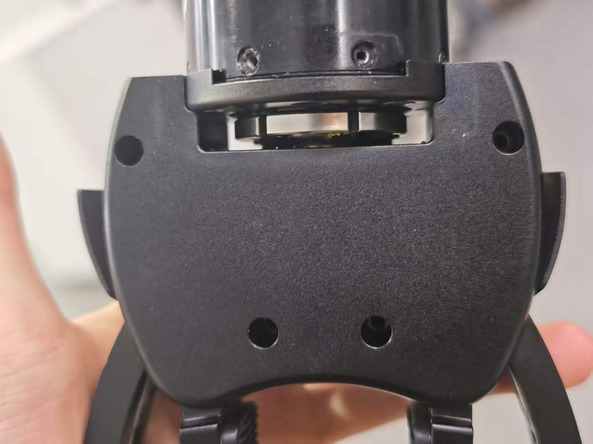
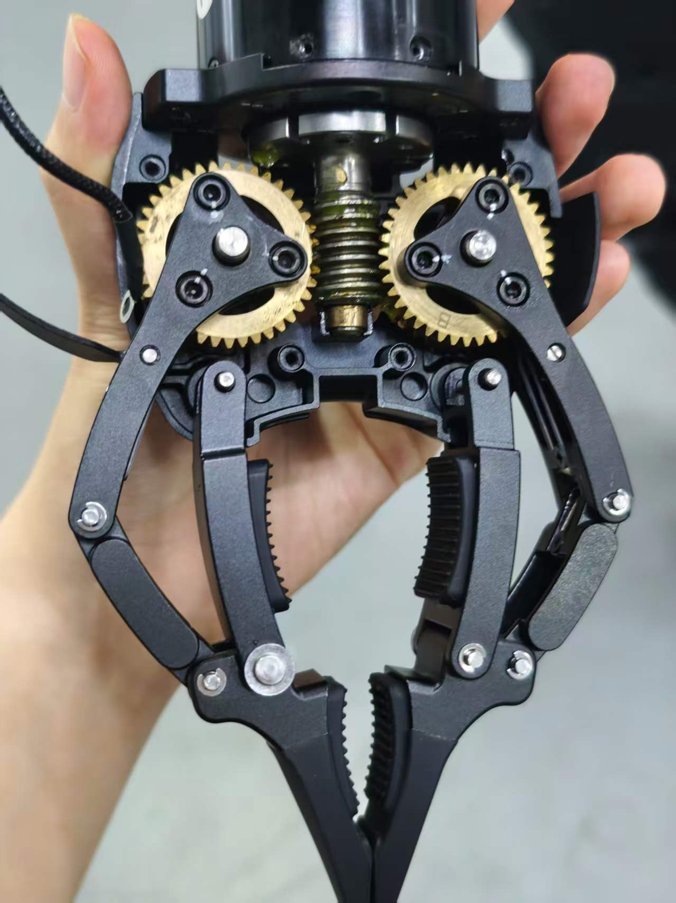

---

# 🤖 Kuavo 机器人 LejuClaw 真机调试与防锁死（Wedge Lock）实战笔记

**项目背景**：在 Kuavo 人形机器人（v42 版本，基于 `biped_s49` 模型库）上进行 LejuClaw 物理夹爪的真机打通。目标是脱离仿真环境，实现夹爪的实机控制，并为后续的具身智能（Embodied AI）视觉抓取任务构建安全、鲁棒的底层控制链。

---

## 🛠️ 第一阶段：软件层打通与环境排雷

在实机上运行哪怕是最简单的测试脚本，也必须跨越 Linux 权限和 ROS 环境变量的连环坑。

### 1. 配置文件切换

在实机下位机主控启动前，必须让系统大脑知道我们挂载的是夹爪而非灵巧手。

* **文件路径**：工作空间对应的 `kuavo.json`。
* **核心修改**：将末端执行器字段修改为 `"EndEffectorType": ["lejuclaw", "lejuclaw"]`。
* **注意**：下位机主程序只有在**开机启动的那一瞬间**才会读取 `kuavo.json` 并执行开机标定（一开一合）。如果先开机再改配置，夹爪将被忽略。

### 2. 编译与权限踩坑 (Permission Denied)

* **报错现象**：执行 `catkin build kuavo_sdk` 时报 `[Errno 13] Permission denied: '/home/lab/kuavo-ros-opensource/build/.built_by'`。
* **原因剖析**：由于涉及到硬件底层驱动，历史编译通常由 `root` 用户执行。普通 `lab` 用户无权覆盖 `root` 创建的 `build` 文件夹。
* **终极解法**：在真机操作中，强烈建议全程提升权限。使用 `sudo su` 切换至 root 后再进行编译和执行。

### 3. 环境与依赖踩坑 (ModuleNotFoundError)

* **报错现象**：在 root 下运行 Python 脚本时，报找不到 `kuavo_msgs` 模块。
* **原因剖析**：`sudo su` 会打开一个干净的 Shell 环境，丢失了之前 source 过的 ROS 工作空间路径。
* **终极解法**：切换 root 后，必须第一时间执行 `source devel/setup.bash`，给当前终端“开眼”，让它找到自定义的 ROS 话题和服务消息类型。

---

## 📡 第二阶段：ROS 通信架构与夹爪 API 深度解析

夹爪的控制逻辑并非盲目的单向开闭，而是基于“一听（Topic）一发（Service）”的状态机闭环。

### 1. 状态反馈链路 (ROS Topic)

* **话题名称**：`/leju_claw_state`
* **消息类型**：`kuavo_msgs/lejuClawState`
* **核心反馈数据**：
* `state`: 当前执行状态（如 `[2, 2]` 代表 `kReached`，即已到达目标位置）。
* `position`: 夹爪当前真实角度/百分比位置。
* `velocity`: 当前真实速度。
* `effort`: 当前实际输出的力矩（极其重要，用于触觉反馈）。


### 2. 指令下发链路 (ROS Service)

* **服务名称**：`/control_robot_leju_claw`
* **服务类型**：`kuavo_msgs/controlLejuClaw`
* **传入参数**：
* `pos`: 目标位置列表 `[左爪, 右爪]`。
* `vel`: 速度限制（通常设为 `[50, 50]` 防撞击）。
* `effort`: 力矩/电流限制（抓取易碎品需调低，如 `0.2`；抓取重物调高，如 `1.0`）。


### 3. 官方 API 的“反直觉”暗坑

官方 WebSocket SDK 文档明文规定，夹爪控制范围为 `0.0 ~ 100.0`：

* **`0` = 完全闭合（紧咬）**
* **`100` = 完全张开**

然而，官方自带的 ROS 示例测试脚本 `robot_end_claw.py` 的作者出现了逻辑失误，误以为数值越大代表越闭合，在代码中写死了 `[90, 90]` 作为 `close claw` 的指令。这一致命失误直接导致了后续的硬件灾难。

---

## 💥 第三阶段：史诗级 Bug 现场 —— 机械锁死 (Wedge Lock)

### 1. 故障表现

机器人开机时，夹爪毫无动静（失去开机标定动作）。运行任何控制脚本，软件层毫无报错，通信全通，但实机双爪完全闭合、死死咬在一起，彻底断电后用纯人力完全无法掰开。

### 2. 抓包溯源（确诊铁证）

保持机器人静止，新开终端运行 `rostopic echo /leju_claw_state`，抓取到以下冰冷的数据：

* `state: [2, 2]`
* **`position: [7.407, 62.962]`**

对比 `kuavo.json` 中官方设定的安全防线：

* `"max_joint_position_limits": [..., 30, 25]`（右爪最大闭合极限量为 25）。

### 3. 硬件崩坏原理还原

* **指令过载**：由于脚本错误发送了 `[90, 90]` 的闭合指令，电机带着 `effort: 1.0` 的最大力矩疯狂向内挤压。
* **突破防线**：在突破了 `25` 的安全限位后，电机无视阻力继续强行发力，硬生生把机械连杆挤压到了恐怖的 **`62.962`**。
* **物理自锁**：强电过度挤压导致齿轮副之间产生了巨大的机械应力，发生了严重的**过度拧紧自锁（Wedge Lock）**。
* **保护触发**：电机被彻底憋停，瞬间触发 `kuavo.json` 里的 `"locked_rotor_protection": 2`（堵转保护）。底层芯片为了防烧，直接切断动力，夹爪从此陷入“上电即堵转断电”的死循环。

---

## 🔧 第四阶段：物理破局与满血复活

面对纯物理死锁，重启软件已经无效，必须实施物理干预。

### 1. 拆壳退轴（卸载应力）

* **操作**：拆卸夹爪外壳，暴露出中央的蜗杆与联轴金属圆盘。
* **解套**：使用内六角或其他工具撬动金属圆盘，**向着“张开”的反方向手动大力旋退**。
* **目标**：直到把死死咬合的爪尖旋开，让它从 `62.96` 退回 `25` 以内的安全区。

### 2. 健康状态判定（非常重要）

* **视觉标准**：双爪分开，肉眼可见间隙。
* **手感标准**：不通电时，爪尖能够自由晃动 **0.5cm ~ 1cm**。
* **原理解析**：这个晃动量叫做**机械回差（Backlash）**，是齿轮与多级连杆正常啮合的健康标志。如果 0 间隙，通电后极易因摩擦力过大发热卡死。通电后，伺服电机会形成位置闭环，瞬间消除这个松动量，因此完全不影响抓取精度。

### 3. 修复代码，杜绝复发

物理复原后，立刻修改 `robot_end_claw.py`，将致死的 `[90, 90]` 降维打击，改为极其保守的 `[15, 15]` 或 `[20, 20]`，随后重新上电，开机标定完美恢复。

---

## 🛡️ 第五阶段：具身智能抓取的防御性编程 (Defensive Control)

### 0. 机械结构原理解析：双蜗轮单蜗杆的“双刃剑”


在拆开夹爪外壳进行物理退轴时，我们清晰地发现该夹爪采用了“单蜗杆-双蜗轮”的传动结构。作为算法开发者，理解这一硬件特性是编写防御性代码的物理前提：

* **优点（为何如此设计）**：
* **超大减速比**：在极小的手腕空间内，能让微型电机爆发出巨大的捏合力。
* **零功耗保持（物理自锁）**：由于蜗轮蜗杆只能单向传动，抓紧物体后即使彻底断电，也能靠机械静摩擦力死死咬住重物不掉落。这不仅极大节省了电池功耗，更有效防止了电机因长时间堵转而烧毁。


* **缺点（致命隐患）**：
* **极易发生破坏性自锁**：一旦上层软件发送了越界的大行程指令，在没有抓取真实物体作为“缓冲垫”的情况下，两片爪子会直接互相死磕。巨大的驱动力矩被全部转化为内部传动副的挤压应力，瞬间就会造成如同死结一般的机械自锁（也就是本次事故的根本原因）。


鉴于这种结构的“非反向驱动”特性，在未来的高级具身智能任务中，绝不能让上层视觉或 AI 算法直接“盲目”指挥底层硬件。必须在控制脚本中构筑以下四道防线，实现力位混合抓取：

### 防线 1：输入源头数据裁剪 (Command Saturation)

绝不信任上层传入的 Raw Data。在调用服务前，强行引入硬边界。

```python
MAX_CLOSE_LIMIT = 20.0 # 留出安全余量
safe_pos = max(0.0, min(MAX_CLOSE_LIMIT, target_input))

```

### 防线 2：动态力矩限制 (Torque Profiling)

不要一上来就把 `effort` 拉满。

* **空载逼近**：使用极低力矩（如 `0.2`），即使撞到硬限位，电机也会因为力气小而安全停转，不会卡死。
* **包络抓取**：确认接触物体后，再短暂提升力矩（如 `0.6`）稳固抓持。

### 防线 3：基于反馈的主动截断 (Effort Monitoring - 触觉防线)

在闭合 `while` 循环中，高频监听 `/leju_claw_state` 话题。

* 若发现 `position` 停止变化，且 `effort` 绝对值突然飙升（阻力剧增），意味着“抓到物体了”或“掐到了死角”。
* **立刻触发 Break**，保持当前位置，并停止追加闭合指令。

### 终极抓取状态机伪代码示例

```python
def adaptive_grasp_cup():
    target_pos = 5.0 # 从微闭合开始试探
    while not rospy.is_shutdown():
        # 1. 强制限幅
        cmd_pos = max(0.0, min(20.0, target_pos))
        
        # 2. 低力矩下发
        call_leju_claw_client([cmd_pos, cmd_pos], [50, 50], [0.2, 0.2])
        time.sleep(0.05)
        
        # 3. 读取触觉反馈
        current_effort = claw_state.effort
        
        # 4. 触觉阻力截断保护
        if abs(current_effort[0]) > 0.4 or abs(current_effort[1]) > 0.4:
            print("【触觉反馈】接触到物体，锁定关节，稳固抓取！")
            call_leju_claw_client([claw_state.position[0], claw_state.position[1]], [0, 0], [0.6, 0.6])
            break
            
        target_pos += 1.0 # 逐步闭合

```

**总结**：一次完美的实机硬件卡死排查，胜过在仿真里跑通一万次。理解物理边界（回差、单蜗杆双蜗轮自锁、堵转），敬畏硬件极限，用软件架构兜底，这就是 Sim-to-Real（仿真到现实）的核心要义。