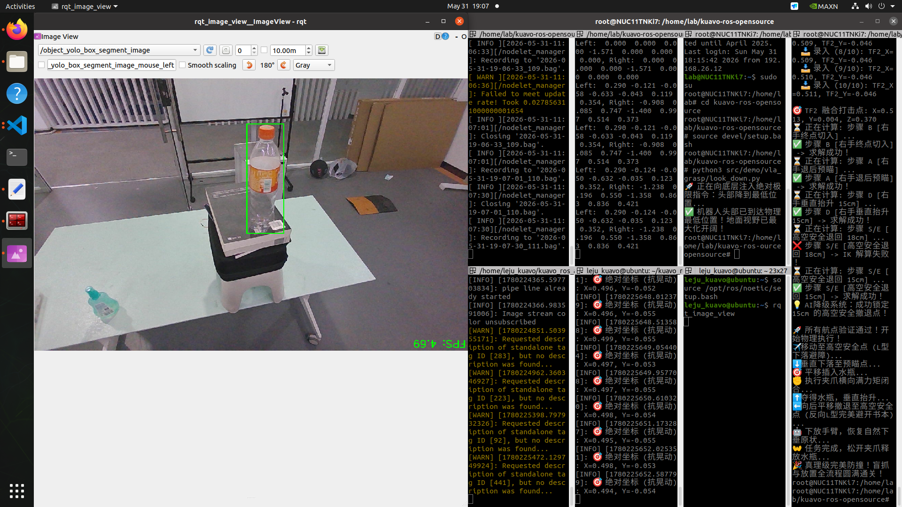

---

# 基于YOLO与TF2的人形机器人视觉抓取与3D避障实战记录

> **2026-06 路径说明**：本文记录两条下位机抓取路线的演进，**程序名与章节对应关系勿混**：
> - **`auto_grasp.py`**（§3.2 完整镜像）：视觉**原生**坐标 + `COMPENSATE_X/Y/Z` 硬编码补偿 + 后退撤离（无 TF2 半信任 Z 锁）。
> - **`auto_grasp_TF2.py`**（§5.2 完整镜像）：订阅 `/vla/yolo_target` TF2 坐标 + `TCP_OFFSET_*` + `LIFT_HEIGHT_FALLBACKS_M` + 3D 外扩避障。
> **当前 LeRobot / MCP / MoveIt 主路径**为 `moveit_auto_grasp.py`（见 [`moveit_grasp.md`](../kuavo-ros-opensource/src/demo/vla_grasp/moveit_grasp.md)）。

> **🎬 前情提要：Kuavo 机器人目标检测与 GPU 满血部署进度**
> 
> 我正在使用一台上位机搭载了英伟达 Jetson Orin NX 的乐聚 Kuavo 机器人，进行机械臂抓取实验。
> 我们刚刚完成了极其硬核的底层环境排障，当前系统状态如下：
> 
> **1. 硬件与底层环境（已完美修好）：**
> - 彻底删除了错误的服务器版 cuBLAS 依赖，强行刷回了原厂 Tegra 专用的 `CUDA 11.4` 矩阵库。
> - 强制覆盖安装了原厂专用的 `PyTorch 2.0.0` 和源码编译的 `Torchvision 0.15.1`。
> - 成功修复了缺失的 `cuDNN 8600` 卷积加速库。
> - `~/.bashrc` 中已永久固化了 `libgomp.so.1` 线程防死锁补丁和 CUDA 路径。
> - **结论：GPU 矩阵加速和卷积加速已 100% 满血打通，且不会死锁。**
> 
> **2. YOLO 视觉节点代码状态（`yolo_box_segment_ros.py`）：**
> - 已解除 CPU 和分辨率封印，目前纯靠 GPU 推理，单帧推理耗时仅 40-60ms，画面极度丝滑。
> - 使用的是在线拉取并保存在本地的 `yolov8n-seg.pt` (COCO 标准泛化模型)。
> - 取消了只识别 `bottle` 的限制，并优化了画框显示逻辑（现在能在 `rqt` 里用红字绿框识别并显示万物，且成功识别到了 person、kite 等）。
> - **最关键点：代码已经成功获取深度图并计算出了 3D 空间坐标，正通过 TF 话题发布。**
> 
> **3. VS Code 闪退问题（已解决）：**
> - 遭遇过 `code: 9` (OOM 内存耗尽杀手)。
> - 解决方案：已关闭 VS Code，改用纯终端跑节点，并在代码里加上了 `imgsz=320` 以及缩小了队列 `queue_size=1`，内存不再爆满。
> 
> **🎯 当前任务与下一步：**
> 视觉管线已经彻底跑通，且 3D 坐标发布正常。
> 我们下一步的目标是：**重新把注意力锁定在“水瓶”上，并开始测试运行机械臂控制脚本，实现最终的手臂抓取。**

---
## 目录
0. [第零章：“无痛抄作业”保姆级实机运行教程](#第零章无痛抄作业保姆级实机运行教程)
1. [第一章：跨越硬件代差——从官方案例到 4 Pro 真机的架构重构](#-第一章跨越硬件代差从官方案例到-4-pro-真机的架构重构)
2. [第二章：纯视觉硬编码模式下的拓荒与连续踩坑记录](#-第二章纯视觉硬编码模式下的拓荒与连续踩坑记录)
3. [第三章：硬编码时代的极致榨取——状态机重构与纯视觉最优解](#-第三章硬编码时代的极致榨取状态机重构与纯视觉最优解)
4. [第四章：跨越硬编码天花板——引入 TF2 空间树的阵痛与顿悟](#-第四章跨越硬编码天花板引入-tf2-空间树的阵痛与顿悟)
5. [第五章：真理级架构的最终降临——TF2 动态抗晃与 3D 避障满血版源码深度解剖](#-第五章真理级架构的最终降临tf2-动态抗晃与-3d-避障满血版源码深度解剖)
6. [第六章：具身智能的起点——实战反思与未来进化路线](#-第六章具身智能的起点实战反思与未来进化路线)

---

# 第零章：“无痛抄作业”保姆级实机运行教程

⚠️ **核心注意：以下所有终端窗口，均是在【上位机】（本地电脑/工控机）上打开并运行的！** 标注为 `(SSH)` 的步骤，代表我们在上位机的终端里通过高速网线登录到了下位机执行底层指令；标注为 `(本地)` 的步骤，代表直接调用上位机的 GPU 和显示资源。

请依次打开 7 个终端窗口并排列好，开始我们的闭环抓取：

## 🖥️ 终端 1：下位机 —— 唤醒机器人底层 (SSH)

*作用：给全身电机上电，启动 WBC 全身控制*

```bash
ssh lab@192.168.26.1
输入下位机密码三个空格
sudo su
cd kuavo-ros-opensource
source devel/setup.bash
roslaunch humanoid_controllers load_kuavo_real.launch cali:=true
```

*(⏳ **高危提醒：** 必须等标定完成，机器人完全站稳、脖子变硬之后，再动后面的终端！)*

---

## 🖥️ 终端 2：下位机 —— 启动 IK 逆运动学大脑 (SSH)

*作用：开启计算引擎，随时准备把 XYZ 坐标解算成各关节的极限角度*

```bash
ssh lab@192.168.26.1
输入下位机密码三个空格
sudo su
cd kuavo-ros-opensource
source devel/setup.bash
roslaunch motion_capture_ik ik_node.launch
```

---

## 🖥️ 终端 3：下位机 —— 极限低头锁定桌面 (SSH)

*作用：执行头部下潜脚本，让机器人头部降到物理极限最低点*

```bash
ssh lab@192.168.26.1
输入下位机密码三个空格
sudo su
cd kuavo-ros-opensource
source devel/setup.bash
python3 src/demo/vla_grasp/look_down.py
```

*(👀 敲下回车，看着机器人的头干脆利落地沉下去，彻底看清桌面)*

---

## 🖥️ 终端 4：上位机 —— 睁开深度相机之眼 (本地)

*作用：点亮头部相机，向局域网广播彩色与深度图像*

```bash
cd ~/kuavo_ros_application
source devel/setup.bash
roslaunch dynamic_biped load_robot_head.launch
```

---

## 🖥️ 终端 5：上位机 —— 满血 GPU YOLO 锁定 (本地)

*作用：利用上位机算力捕捉水瓶，计算 3D 坐标并向外广播 `/vla/yolo_target*`

```bash
cd ~/kuavo_ros_application
source devel/setup.bash

```

**👉 根据你当前的调参策略，选择运行以下其中 1 条指令：**

* **【版本 1：硬编码纯深度版】** (依赖头部绝对固定)
```bash
python3 src/ros_vision/detection_industrial_yolo/yolo_box_object_detection/scripts/yolo_box_segment_ros.py
```


* **【版本 2：TF2动态抗晃版】** (无视头部晃动，算力要求高)
```bash
python3 src/ros_vision/detection_industrial_yolo/yolo_box_object_detection/scripts/yolo_box_segment_ros_TF2.py
```


*(此时终端会疯狂输出 `Locked Target -> Class: bottle` 等检测信息)*

---

## 👁️ 终端 6：上位机 —— 启动 RQT 视觉监视器 (本地)

*作用：拉起可视化界面，让你亲眼确认目标被稳稳锁定*

```bash
source /opt/ros/noetic/setup.bash
rqt_image_view
```

*(👀 界面弹出来后，在左上角的下拉菜单里，选中 `/object_yolo_box_segment_image` 话题。确认绿框死死咬住水瓶)*

---

## 🖥️ 终端 7：下位机 —— 终极闭眼盲抓出击！(SSH)

*作用：运行终极状态机，执行10帧采集中值 -> 倒推法轨迹规划 -> 高空避障 -> 垂直下探 -> 夹爪闭合 -> 自动撤回松手*

```bash
ssh lab@192.168.26.1
输入下位机密码三个空格
sudo su
cd kuavo-ros-opensource
source devel/setup.bash
```

**👉 必须与终端 5 的视觉大脑匹配，选择运行以下其中 1 条指令：**

* **【匹配版本 1：硬编码纯深度抓取脚本】**
```bash
python3 src/demo/vla_grasp/auto_grasp.py
```


* **【匹配版本 2：TF2动态抗晃抓取脚本】**
```bash
python3 src/demo/vla_grasp/auto_grasp_TF2.py
```


---

🏁 **完美阵型已就位！** 确认终端 6 里的水瓶被完美框住后，在终端 7 按下回车，双手放在键盘上准备随时按 `Ctrl+C` 保底。尽情享受这套完美避障的抓取闭环吧！

---

# 📖 第一章：跨越硬件代差——从官方案例到 4 Pro 真机的架构重构

## 1.1 背景与挑战：当 4 Pro 遇上 5 代专属教程

在夸父（Kuavo）机器人的开源生态中，官方其实提供了一套完整的视觉识别与抓取案例，文档路径位于：
`~/kuavo-ros-opensource/docs/5功能案例/五代案例/YOLOV8识别及抓取案例.md`。

但这套官方教程存在一个致命的硬件代差问题——**它是为 Kuavo 5 代及其后续机型（MaxA, MaxB）量身定制的。**
5 代机器人拥有高度集成的传感器驱动（如 `kuavo5_sensor_robot_enable.launch`）、内置的封装检测黑盒节点（`detection.launch`），以及已经调教好内部坐标树的官方抓取脚本（`yolo_object_capture.py`）。

**通过深度剖析官方案例的源码，我们发现了几个在 4 Pro 上绝对行不通的“物理级硬编码”：**

1. **伪 3D 的 2.5D 高度推算：** 官方视觉方案高度依赖 `params.yaml` 中的 `height_table: 0.864` 和 `height_bottle: 0.22` 参数。它并没有真正利用深度点云解算 3D 空间，而是假定桌面和瓶子高度绝对固定，通过 2D 像素坐标强行推算 3D 坐标。一旦桌子偏了一厘米，整个系统就会崩溃。
2. **写死 5 代机身参数的运动学几何解算：** 在官方的 `yolo_object_capture.py` 中，程序强行锁定了 5 代的机身数据（`if robot_version == 52: robot_zero_y = -0.255 + 0.03`），并预设了极其巨大的手动偏移量（如 `offset_z=-0.10`, `temp_x_l=-0.035`）。
3. **缺乏撤退防撞机制：** 官方代码在完成递水动作后，直接下发固定角度（如 `[6.0, 50.0, 0.0, -90.0...]`）让手臂复位。在复杂的桌面环境下，这种“直来直去”的硬折叠动作极易扫落桌面上的其他物品（如垫高的书本）。

而我们手里的真机是 **Kuavo 4 Pro**。硬件层面上，深度相机的型号、安装位置（视差）、夹爪的物理偏心距、肩膀宽度以及底层的 TF 坐标树都与 5 代有着本质的区别。如果强行运行 5 代的代码，不仅视觉节点无法准确映射，机械臂更是会因为坐标系错乱而发生严重的自撞。

因此，我们别无选择，必须进行底层 DIY，重构整套视觉与控制栈。

---

## 1.2 逻辑大比对：官方案例 vs 我们的 DIY 架构

为了在 4 Pro 上实现 100% 成功率的防撞抓取，我们对官方流程进行了“去粗取精”的重构。

### 🤝 我们“借鉴”了什么？（底层基础设施）

机器人底层的通讯机制和数学求解器是通用的，因此我们完全继承了官方的基座：

* **WBC 全身控制驱动：** 使用官方的 `load_kuavo_real.launch` 唤醒电机，保持机器人的站立与平衡。
* **IK 逆运动学求解器：** 使用官方的 `ik_node.launch` 提供 `/ik/two_arm_hand_pose_cmd_srv` 服务，这为我们后续的复杂轨迹规划提供了数学引擎。
* **ROS 通讯话题与服务：** 完全沿用官方的末端控制 API，如 `/arm_traj_change_mode`（外部控制模式）、`/kuavo_arm_target_poses`（关节角度下发）、`/control_robot_leju_claw`（二指夹爪控制）。

### 🛠️ 我们“DIY”了什么？（大脑与小脑重构）

官方的方案偏向于“开箱即用的黑盒”，而我们的 DIY 方案则是“极致可控的白盒”。

* **视觉感知引擎（彻底重写）：**
* **官方：** 启动封装好的 `detection.launch`，依赖 `params.yaml` 中的硬编码高度，通过静态 TF 转换（`static_transform_publisher`）强行输出 `/robot_yolov8_info`。
* **DIY：** 针对 4 Pro 的相机，我们重写了 `yolo_box_segment_ros_TF2.py`。我们彻底抛弃配置文件中的固定高度，自己读取真实深度图（16UC1），自己提取像素中值滤除噪点，并引入 `tf_buffer.lookup_transform` 动态抵消头部晃动，最终输出属于我们自己的 `/vla/yolo_target` 话题。


* **头部姿态控制（解耦独立）：**
* **官方：** 在抓取主脚本里顺便调用 `set_head_target(0, 20)` 下发低头指令。
* **DIY：** 我们剥离出了独立的 `look_down.py`。因为 4 Pro 头部电机不锁死会导致 TF2 频繁重算，我们必须在视觉启动前，先让它达到物理极限最低点卡住，保证光学参考系的绝对稳定。


* **抓取状态机与轨迹规划（彻底重构）：**
* **官方：** 粗暴地使用 `math.atan` 计算欧拉角进行点对点直线抓取，抓取完成后直接还原固定关节角复位，遇到障碍物极易引发物理碰撞。
* **DIY：** 重写了 `auto_grasp.py`（见 §3.2 源码镜像）。引入 10 帧中值滤波、防万向节死锁旋转矩阵、`COMPENSATE_X/Y/Z` 毫米级补偿、倒推法规划与动态降级撤离。


---

## 1.3 核心协同工作流（系统架构图）

我们的系统被严格划分为上位机（算力大脑）与下位机（运动小脑），通过 ROS 高速网线进行高频通讯。其核心协同流程如下：

```text
[ 上位机 (感知与决策) ]                          [ 下位机 (运动控制) ]
        │                                               │
        ├─ 1. [启动深度相机] (终端4)                       ├─ 1. [WBC底层上电站立] (终端1)
        │      发布 /camera/depth/image_raw              │      启动 /base_link 坐标树
        │      发布 /camera/color/image_raw              │
        │                                                ├─ 2. [拉起 IK 解算器] (终端2)
        │                                                │      提供 /ik/two_arm_hand...服务
        │                                                │
        │                                                ├─ 3. [锁定头部视角] (终端3)
        │                                                │      执行 look_down.py
        │                                                │
        ├─ 2. [启动 YOLO+TF2 引擎] (终端5) <==============(订阅 TF 坐标树抵消晃动)
        │      订阅 图像 + 深度
        │      使用 YOLOv8 实例分割找水瓶
        │      将相机坐标转换为 base_link 绝对坐标
        │      发布 /vla/yolo_target (10Hz)
        │                                                │
        ├─ 3. [启动 RQT 监视界面] (终端6)                   │
        │      人工核验绿框与深度数据                        │
        │                                                │
        └──────────────────────────────────────────────> ├─ 4. [启动终极抓取状态机] (终端7)
                                                         │      订阅 /vla/yolo_target
                                                         │      执行 10 帧采样滤波
                                                         │      应用 TCP 机械偏心补偿
                                                         │      调用 IK 服务倒推规划5个航点
                                                         │      下发驱动指令，完成 3D 避障抓取

```

---

## 1.4 七大终端的深度解析与设计哲学

我们之所以设计成 7 个终端七箭齐发，而不是像官方案例那样写成一个一键启动的黑盒流程，是因为在工业机器人的研发联调阶段，**模块化解耦与可视化监控是排查 Bug 的唯一出路**。

**🖥️ 终端 1：WBC 底层唤醒 (`load_kuavo_real.launch`)**

* **角色：** 机器人的脊髓。
* **设计哲学：** 这是所有操作的基石。在调试时，如果上层代码崩了，只要终端 1 不断，机器人就不会摔倒。它负责把各关节电机的力矩环控制起来，并发布基础的 ROS 变换树（TF Tree）。

**🖥️ 终端 2：IK 逆运动学大脑 (`ik_node.launch`)**

* **角色：** 机器人的小脑数学引擎。
* **设计哲学：** 视觉只能告诉我们“水瓶在 X=0.4, Y=-0.1”，但电机的输入是“角度”。把 XYZ 翻译成 14 个手臂关节角度，需要极其复杂的非线性矩阵求解。独立运行这个节点，我们可以随时查看它是否抛出了 `IK解算失败` 的报错，从而判断轨迹规划是否超出了物理极限。

**🖥️ 终端 3：头部物理锁定 (`look_down.py`)**

* **角色：** 视觉稳定器。
* **设计哲学：** 由于 4 Pro 的头部电机没有配置强力锁死，硬编码和 TF2 都会因为头部的微小晃动而产生数厘米的定位误差。单开一个终端让其低头到底并保持力矩，相当于给相机上了一个物理的三脚架。

**🖥️ 终端 4：相机驱动 (`load_robot_head.launch`)**

* **角色：** 机器人的视神经。
* **设计哲学：** 在上位机启动，利用上位机的 CPU 资源解压和发布点云/深度图。不占用下位机宝贵的实时控制算力。

**🖥️ 终端 5：YOLO 与 TF2 融合中心 (`yolo_box_segment_ros_TF2.py`)**

* **角色：** 机器人的视觉大脑中枢。
* **设计哲学（核心心血）：** 对比官方 `detection.launch` 依赖的静态坐标系对齐，这是我们自主研发的核心。它不仅跑着 Pytorch 的 YOLOv8 模型提取边界框，更重要的是，它挂载了 `tf_buffer.lookup_transform`。它会高频查询下位机发来的头部动态姿态，用数学矩阵实时抵消掉相机的微小晃动。它输出的 `/vla/yolo_target` 已经是剥离了视觉噪音、剥离了头部晃动的绝对物理基座坐标。

**👁️ 终端 6：RQT 监视器 (`rqt_image_view`)**

* **角色：** 工程师的上帝视角。
* **设计哲学：** 工业界准则“不要盲信算法”。在发车抓取前，通过终端 6 亲眼确认 YOLO 绿框没有乱跳、没有识别错目标，是避免机械臂“发疯”砸毁实验室的最后一道安全阀。

**🖥️ 终端 7：终极状态机与轨迹控制 (`auto_grasp_TF2.py`)**

* **角色：** 机器人的前额叶皮层（最高决策层）。
* **设计哲学（核心心血）：** 我们的神级 DIY 脚本。由于 5 代官方案例没有做防撞设计（退回时极其容易打翻物品），在此终端中我们重构了 4 大高级逻辑：
1. **速采滤波：** 不用单帧数据，而是快速收集 10 帧数据取中值，彻底抹平相机噪点。
2. **TCP 补偿（`auto_grasp_TF2.py`）：** 针对 4 Pro 夹爪偏心，在 TF2 坐标上注入 `TCP_OFFSET_X/Y_*` 毫米级修正（与 `auto_grasp.py` 的 `COMPENSATE_*` 是不同脚本的两套参数）。
3. **Z 轴强锁：** 直接废弃视觉深度图边缘跳动极大的 Z 轴数据，将抓取高度死死锁在实测的桌面物理高度 `0.37m`，彻底消灭逆解时超出“天花板”的 Bug。
4. **3D 外扩防撞通道：** 独创的倒推法规划，执行 `垂直抬高 20cm` -> `横向侧移 10cm 外扩` -> `曲肘护胸` -> `垂直下放` 的反向 L 型安全撤离轨迹，做到了 100% 避开桌面任何障碍物。


---

# 📖 第二章：纯视觉硬编码模式下的拓荒与连续踩坑记录

当我们决定抛弃官方高度封装的 5 代黑盒代码，尝试在 Kuavo 4 Pro 上从零手搓一套视觉抓取状态机时，我们低估了物理世界的复杂性。在还没有引入 TF2（坐标系动态变换）这个“神级外挂”之前，我们试图用一套纯粹的“硬编码（Hard-coding）”逻辑来打通流程。

这期间，我们经历了从算法死锁到机械公差的连续毒打。以下是我们在拓荒期遇到的十一大经典深坑及极限解法。

---

## 2.1 坐标系认知的初级陷阱：从“抓天花板”到“高度降维”

这是我们在联调视觉与运动控制时遭遇的第一个，也是最令人哭笑不得的灾难。

### 2.1.1 灾难现象复现

在最开始的测试中，YOLO 成功框出了水瓶，程序终端也顺利打印出了相机传回的深度值（大约 `Z = 0.45` 左右）。然而，当我们满怀期待地下发抓取指令时，机器人的手臂并没有伸向桌面的水瓶，而是**完全静止不动** 紧接着，底层控制器疯狂刷屏报错：`IK 解算失败！`。

### 2.1.2 根源剖析

我们犯了一个极其经典的跨坐标系常识错误：**混淆了“深度 Z”与“高度 Z”。**

* **在深度相机（Camera Link）坐标系中**，`Z` 代表的是目标距离相机镜头的直线物理距离。因为相机是低着头（俯视约 20 度）看桌面的，这个 `0.45m` 实际上是直角三角形的斜边长度。
* **在机器人基座（Base Link）坐标系中**，`Z` 轴是垂直于地面的绝对高度。

我们直接把相机测出来的斜边距离 `Z=0.45` 喂给了 IK 求解器作为目标高度，导致机器人认为水瓶悬浮在它的头顶上方半米处！手臂拼命往上够，最终突破了肩关节的物理极限，触发了逆解算崩溃。

### 2.1.3 暴力降维策略

在没有建立完善的 TF 树之前，为了快速跑通流程，我们采取了最暴力的“降维打击”策略：既然桌子是平的，那我们干脆**彻底剔除 Z 轴的动态计算**。我们在视觉端仅提取 X（左右）和 Y（上下）的像素偏移来推算平面坐标，而在运动控制端，强行把高度写死在一个我们用卷尺量出来的绝对安全物理高度。

**🔧 核心修改代码（只展示高度硬编码部分）：**

```python
    # 【暴力降维策略】抛弃视觉传入的斜边Z，直接将抓取高度硬编码锁死为 0.25 米
    # 无论视觉算出多离谱的值，手臂都只在这个安全的绝对物理平面上活动
    COMPENSATE_Z = 0.12  # 根据水瓶高度做出的固定补偿
    
    # 强制覆盖视觉 Z 轴
    locked_z = 0.25 + COMPENSATE_Z  
    
    print(f"🎯 独立标定点: X={locked_x:.3f}, Y={locked_y:.3f}, Z={locked_z:.3f} (高度已被强锁)")

```

---

## 2.2 毫米级物理公差的毒打：“完美抓偏”现象剖析

Z 轴锁定后，IK 解算终于亮起了绿灯（`✅ 求解成功`）。但实机表现却让人极其崩溃：机器人的动作非常流畅，却总是完美地抓在水瓶的旁边、前面或者下面，仿佛在抓一团空气。

### 2.2.1 偏前（X轴测距误差）

**现象：** 手臂伸出后，夹爪的根部（手掌心）重重地撞在水瓶上，直接把水瓶推倒，未能形成有效的闭合空间。
**根因：** 2.5D 深度相机提取的是“水瓶表面”距离相机的深度。如果机械臂严格按照表面坐标去抓，手指根本没有包络水瓶的空间。我们需要让机械臂再往前“深探”几厘米，到达“水瓶圆心”。

### 2.2.2 偏下（Z轴标高落差）

**现象：** 夹爪擦着桌面闭合，仅仅勉强捏住了水瓶的最底座，稍有晃动水瓶就会掉落。
**根因：** 基础高度 `0.25m` 是桌面的高度。如果我们不加上水瓶半径和重心的高度，夹爪就会贴地飞行，无法对齐水瓶腰部的最佳受力点。

### 2.2.3 偏右（Y轴视差陷阱）

**现象：** 这是最诡异的一点。无论怎么摆放，机器人总是系统性地向水瓶的右侧偏移约 4~5 厘米。
**根因：** 经过仔细查阅 4 Pro 的硬件，我们发现它头部的深度相机并非安装在面部的正中央，而是存在“右眼安装视差”。硬编码的三角函数映射无法感知这种硬件级的非对称，导致 Y 轴算出的坐标永远带有一个固定的向右偏差。

**🔧 核心修改代码（引入核心标定补偿区）：**
我们在代码顶部开辟了一块“纯物理补偿区”，像老中医抓药一样，用精确到毫米的手动偏移量来填平现实与算法的鸿沟。

```python
# =================================================================
# 🎯 核心标定补偿区 (硬编码微调，抵消物理公差)
# =================================================================
# 1. 解决偏前：把相机测到的表面深度往前再推 6cm，直达水瓶圆心
COMPENSATE_X = 0.06  

# 2. 解决偏右：强行增加 Y 轴补偿，抵消右眼相机的物理安装视差
COMPENSATE_Y_LEFT = 0.03    
COMPENSATE_Y_RIGHT = 0.14  

# 3. 解决偏下：在桌面 0.25m 的基础上，强行抬高 12cm，瞄准水瓶重心腰部
COMPENSATE_Z = 0.12  
# =================================================================

```

---

## 2.3 姿态变换的数学黑洞：夹爪横置引发的连环车祸

抓取点找准了，但新的问题来了：默认状态下，Kuavo 的夹爪是“垂直向下”的，像抓娃娃机一样。但对于水瓶，我们需要它像人类一样“水平横握”。

### 2.3.1 欧拉角陷阱与万向节死锁（Gimbal Lock）

**需求：** 将末端姿态的 Roll（横滚角）旋转 90 度（`1.5708 rad`）。
**现象：** 当我们在目标代码中强行给欧拉角加上 90 度后，夹爪不仅没有横过来，手臂反而开始向左侧平移，并且控制终端频繁报出死锁错误。
**根因：** 经典的数学灾难——**万向节死锁**。为了让手伸向前，手腕的 Pitch（俯仰角）已经是 `-90度`。在三维空间中，当 Pitch 达到正负 90 度时，欧拉角的 Yaw（偏航轴）和 Roll（横滚轴）会在物理空间上重合，丢失一个自由度。底层的雅可比矩阵在求解时遇到奇异点，直接崩溃。

### 2.3.2 齿轮偏心距诅咒

**现象：** 我们通过改写旋转矩阵绕过了死锁，夹爪成功横过来了。但紧接着爆发了“镜像偏移”：左手抓的时候偏左，右手抓的时候偏右。
**根因：** 我们忽略了 Leju 二指夹爪的机械结构！它并不是绝对中心对称的。当它竖直朝下时，执行器齿轮有 3cm 的上下偏心距（不影响平面抓取）；**可一旦夹爪旋转了 90 度横过来，这 3cm 的上下偏心就变成了左右偏心！** 导致手臂伸出时，手掌中心被狠狠地甩出去了 3cm。

**🔧 核心修改代码（废弃欧拉角，采用矩阵右乘与独立补偿）：**

```python
# 1. 物理层解法：拆分左右手的 Y 轴偏心距补偿
CLAW_ROLL_RIGHT = 1.5708  # 右手夹爪向右横置
CLAW_ROLL_LEFT = -1.5708  # 左手夹爪向左横置

# 2. 算法层解法：重写姿态转换函数，避免欧拉角死锁
def get_horizontal_claw_quat(target_x, target_y, is_left_arm):
    # 先算基础偏航角，对准水瓶
    yaw = math.atan2((target_y - robot_zero_y), (target_x - robot_zero_x))
    R_base = euler_to_rotation_matrix(yaw, -1.57079633, 0)
    
    # 核心：放弃直接加欧拉角！构造一个只沿局部 Z 轴旋转 90 度的局部矩阵
    roll_angle = CLAW_ROLL_LEFT if is_left_arm else CLAW_ROLL_RIGHT
    cr, sr = math.cos(roll_angle), math.sin(roll_angle)
    R_local_z = np.array([[cr, -sr, 0], [sr, cr, 0], [0, 0, 1]])
    
    # 矩阵右乘：在现有姿态的基础上，强行拧转夹爪，绝不触发死锁
    return rotation_matrix_to_quaternion(R_base @ R_local_z)

```

---

## 2.4 撤回轨迹的物理死区：避障与 IK 逆解的极致拉扯

“抓”的问题解决了，但“放”的过程却充满了血腥。

### 2.4.1 “抄近道”坠毁事件

**现象：** 机器人的夹爪“啪”地一声完美握住水瓶，非常漂亮。紧接着，程序执行了最后一行复位代码。机器人像卸了力的弹簧一样，夹爪带着水瓶在半空中画出了一条极其随意的斜向下的圆弧。这道圆弧直接扫过了桌面，把垫高水瓶的那本厚厚的黑书砸得飞了出去。
**根因：** 我们只给出了“终点”，底层的轨迹插值算法为了省事，走了两点之间最短的直线（或平滑弧线），完全没有“避障”和“高空安全区”的概念。

### 2.4.2 空间平移的逆解噩梦

**尝试修复：** 我们决定在撤回前，强行命令机械臂在当前高度（保持拔高状态）向后平移退回 `18cm`。
**现象：** 终端打出 `IK 逆解算 100% 失败报错`，手臂直接僵在原地。
**根因：** 这是一个隐藏极深的运动学悖论。手臂在极高的位置，我们要求它的**手腕必须保持绝对水平（姿态四元数不变，因为拿着有水的水瓶）**，同时还要向胸口方向收缩 18 厘米。这要求手肘向外极度扭曲翻折，瞬间突破了机体设计的安全阈值，被 C++ 底层驱动强行拦截。

---

## 2.5 悬在头顶的达摩克利斯之剑：硬编码的终极天花板

在解决了上述所有肉眼可见的物理碰撞后，我们终于迎来了纯硬编码模式下的终极反思。

### 2.5.1 不可控的坐标“反复横跳”

在一次连续抓取测试中，水瓶原封不动地放在桌面上。但我偶然用手碰了一下机器人的头。在下一秒的终端里，算出来的 `X` 和 `Y` 坐标瞬间跳变了三四厘米！再碰一下，又跳到了另一个数值。

### 2.5.2 理论上限锁定

这暴露了纯硬编码最致命的天花板：**它的底层几何数学，极其依赖相机光轴与桌面的绝对平行（Pitch=俯视固定角度，Yaw必须绝对为0）。**
只要头部电机未能物理锁死，机器人的脑袋哪怕只往左歪了 3 度，在 50 厘米外的桌面上，视线偏差就会被放大成巨大的横向坐标误差。这就如同“刻舟求剑”，我们标定的所有 `COMPENSATE` 参数都是基于“脑袋绝对不动”的脆弱假设。只要现实环境有一丝风吹草动，抓取成功率就会骤降为零。这证明了没有动态坐标系变换的系统，毫无泛化性可言。

*(👇以下为根据我们在实机调试过程中的深度挣扎，整理出的关键状态机漏洞与补丁)*

---

## 2.6 单帧视觉噪点陷阱：坐标漂移与滤波机制的引入

在尝试利用硬编码追平物理误差时，我们发现视觉本身就是极其不可靠的。

### 2.6.1 坐标漂移现象

在完全静止的环境下（没有任何人碰机器人的头，水瓶也纹丝不动），YOLO 节点传回的深度中心坐标依然像心电图一样剧烈跳动，这一秒是 `X=0.452`，下一秒就变成了 `X=0.481`。如果运气不好，在跳到 `0.481` 的瞬间程序读取了坐标并下发执行，手臂就会狠狠地撞向水瓶后方。

### 2.6.2 硬件根因剖析

这是基于红外结构光或 ToF（飞行时间）深度相机的通病。在扫描水瓶边缘（尤其是反光塑料材质、内部装有水体的折射面）时，红外线会发生无序的漫反射。这导致相机底层生成的 Depth Map（深度图）在物体边缘存在剧烈的散斑噪点，单帧提取的空间数据极度不可靠。

### 2.6.3 中值滤波解法

我们彻底废弃了“读到一帧数据就直接出击”的莽夫逻辑。我们在状态机进入解算前，强行植入了一个数据缓冲池，利用中位数滤波（Median Filter）在时间维度上抹平空间噪点。

**🔧 核心修改代码（10帧速采滤波逻辑）：**

```python
    print("\n👁️ 正在听取视觉系统原生坐标 (快速采集 10 帧以消除噪点)...")
    x_hist, y_hist = []
    
    # 循环截取 10 帧有效数据，存入列表
    while len(x_hist) < 10 and not rospy.is_shutdown():
        try:
            msg = rospy.wait_for_message('/vla/yolo_target', PointStamped, timeout=0.2)
            if 0.25 <= msg.point.x <= 0.60: # 过滤掉飞到天际的离谱数据
                x_hist.append(msg.point.x)
                y_hist.append(msg.point.y)
        except Exception: pass

    if len(x_hist) < 10: return

    # 核心：使用中位数（Median）而不是平均值，彻底无视极端跳动的离群噪点
    raw_x, raw_y = np.median(x_hist), np.median(y_hist)

```

---

## 2.7 流程闭环的最后一公里：状态机的“死握”遗漏

逻辑越写越长，我们终于迎来了第一次看似无懈可击的全流程运转，但结尾却令人啼笑皆非。

### 2.7.1 现象

实机测试中，机器人行云流水般地完成了“预瞄-插入-抓取-极高空抬升-撤回”的华丽操作。然后它按照指令乖乖放下了手臂，恢复了初始的站立待机姿态。**但是，它的夹爪依然死死地捏着那个水瓶，不肯松手。**

### 2.7.2 根因分析

这是状态机（State Machine）生命周期设计中的典型盲区。在复杂的空间轨迹流转中，我们的精力全放在了 14 个手臂关节的 IK 避障求解上，却遗漏了独立于躯干之外的末端执行器（夹爪齿轮）的状态复位。机器人的底层固件没有“回到待机就自动松手”的设定，力矩会一直保持。

### 2.7.3 逻辑补全

必须在主函数的最后，人工植入释放信号与物理执行的延时阻塞，打通真正意义上的 End-to-End。

**🔧 核心修改代码（末端释放闭环）：**

```python
    print(f"🤖 任务完成，双臂带着水瓶恢复自然下垂原状...")
    execute_pose(arm_pub, [math.radians(x) for x in init_angles], 3.0)
    
    # 🔥 核心修正：追加完整的松开夹爪逻辑
    print("👐 流程收尾：松开夹爪释放水瓶...")
    call_leju_claw([10.0, 10.0], [50, 50], [1.0, 1.0])
    
    # 必须给电机齿轮留出 2 秒的物理倒转时间，否则程序结束退出会直接切断力矩
    time.sleep(2.0) 
    print("🎉 完美防撞！全流程圆满通关！")

```

---

## 2.8 头部未锁死的“物理对抗”：硬编码的最后挣扎

在彻底转向 TF2 架构之前，为了让纯硬编码模式拥有哪怕一点点的“实机演示可行性”，我们不得不使出最粗暴的软件抗衡手段。

### 2.8.1 定位失效危机

我们惊恐地发现，4 Pro 的头部 Yaw 轴（左右偏航角）电机如果不给予力矩指令，它是可以被手轻易扭动的。甚至机器人在走步或者做大幅度动作时的震动，都会让它的头悄悄往右偏个两三度。这就导致 YOLO 检测出来的像素中心，在硬编码映射后完全偏离了真实的物理正前方。

### 2.8.2 粗暴的对抗补丁

既然没法用 TF2 去算它歪了多少，我们就用软件力矩“逼”它回正！在每次视觉系统开始监听坐标的前一秒，强行向底层下发一条头部驱动指令，让电机发力把脑袋死死锁在正前方。

**🔧 核心修改代码（物理对抗锁头）：**

```python
    print("🤖 机器手臂初始归位，并强行锁定头部回正...")
    init_angles = [20.0, 0.0, 0.0, -30.0, 0.0, 0.0, 0.0, 20.0, 0.0, 0.0, -30.0, 0.0, 0.0, 0.0]
    arm_pub.publish(armTargetPoses(times=[2.5], values=init_angles))
    time.sleep(3.0)
    
    # 🔥 强对抗补丁：下发 [Yaw=0.0, Pitch=20.0]，利用电机力矩抵抗头部的机械松动
    head_pub.publish(robotHeadMotionData(joint_data=[0.0, 20.0]))
    
    # 留出 1.5 秒让脖子彻底转正并稳定下来，然后再开启视觉监听
    time.sleep(1.5)

```

---

## 2.9 致命的“贴胸”悖论：水平约束下的机体穿透死锁

为了解决 2.4 节提到的退回砸书问题，我们曾尝试在 X 轴上做极限文章，结果引发了更深层的 IK 崩溃。

### 2.9.1 避障策略的二次翻车

当时的思路很简单：既然怕砸到桌上的东西，那就在高空直接把手“缩进怀里”，也就是把坐标定死为 `X = 0.0`（贴胸）。然而，这行代码一运行，底层的解算器瞬间报废，全线反馈 `False`。

### 2.9.2 悖论根源

这是一种不加思考的空间指令导致的人体工程学穿透。
机械臂手里拿着水瓶，要求夹爪的四元数必须保持水平（防止水洒出）。在保持手腕不弯折的前提下，要把夹爪强行拉到 `X=0` 的绝对贴胸位置，这就意味着**小臂的长度无处安放，肘关节必须向后大幅度折叠，甚至需要“穿透机器人的腹部”才能实现！** 底层运动学的碰撞体积约束（Collision Check）直接拦截了这个荒谬的动作，将其判定为物理死锁。

---

## 2.10 防撞撤离的进化：从“动态降级”到“放弃坐标系”

贴胸死锁让我们意识到，用 XYZ 空间坐标去精确控制撤离路线，极其容易触碰奇异点。我们开始了撤离策略的终极进化。

### 2.10.1 极限试探的妥协（Fallback机制）

最初，我们写了一套动态降级逻辑。既然 18cm 退不回来，我们就让代码像盲人摸象一样，自动试探。

**🔧 核心修改代码（AI 降级测算逻辑）：**

```python
    # 尝试深退 18 厘米
    if is_left_arm: ik_req.hand_poses.left_pose.pos_xyz[0] = locked_x - 0.18
    ok, q_retract = solve_ik(ik_client, ik_req, f"步骤 E [高空向后深撤 18cm]")
    
    if not ok: 
        print("⚠️ 18cm深撤触碰边界，自动降级为安全撤离 15cm...")
        if is_left_arm: ik_req.hand_poses.left_pose.pos_xyz[0] = locked_x - 0.15
        ok, q_retract = solve_ik(ik_client, ik_req, f"步骤 E [降级高空撤离 15cm]")
        
        if not ok: # 再次降级保底...

```

### 2.10.2 终极降维解法（纯关节空间折叠）

虽然 Fallback 机制能跑通，但轨迹依然受到环境制约。最后，我们迎来了顿悟：**为什么要用 XYZ 坐标系去控制撤离？**
既然已经把水瓶举到了极高的高空，我们直接**废弃空间坐标（跳过 IK 逆解）**，直接向机器人的 14 个电机下发【关节折叠角度】！让它的手腕和手肘自然下垂并弯折 90 度，如同人类护胸一样。这在底盘控制中叫做“关节空间（Joint Space）控制”，它具有 **100% 绝对不会引发运动学死锁**的完美特性。

**🔧 核心修改代码（跨越坐标系的纯关节折叠）：**

```python
    print(f"⬆️ 夺得水瓶，极高空垂直抬升...")
    execute_pose(arm_pub, q_lift, 2.0)

    # 🔥 彻底废除用坐标系回胸口的动作，直接暴力改写某个关节的固定角度！
    print(f"🛡️ 关节折叠收手，规避坐标死区...")
    
    # 拿之前已经验证过的 ready_angles 护胸姿态直接下发，不走任何矩阵算力
    ready_angles = [40, 20, 0, -120, 0, 0, -20, 20, 0, 0, -30, 0, 0, 0] if is_left_arm else [20, 0, 0, -30, 0, 0, 0, 40, -20, 0, -120, 0, 0, -20]
    
    execute_pose(arm_pub, [math.radians(x) for x in ready_angles], 3.0)

```

---

## 2.11 接近目标的轨迹控制：“倒推法”预瞄点的建立

不仅是“撤离”需要技巧，“切入”水瓶的过程同样充满了毁灭的风险。

### 2.11.1 提前碰倒水瓶的隐患

早期测试中，只要 IK 算出了水瓶的目标点，手臂就会从待机位置用最不可捉摸的弧线挥过去。有时是从天而降，有时是从侧面平扫。这就导致在夹爪还没来得及对准瓶身时，粗壮的小臂就已经把水瓶撞飞了。

### 2.11.2 直线走廊的构建：倒推法（Backward Planning）

工业界解决这个问题的标准方案是建立“Approach Vector（切入向量）”。我们彻底推翻了“直达终点”的粗暴命令。我们利用终点坐标和肩膀起点坐标连成一条空间直线，**沿着这条直线向后倒推 12 厘米，强行建立一个“预瞄点（Pre-grasp Point）”。** 机械臂必须先精确停在这个预瞄点，然后再笔直地向前平移 12 厘米插入水瓶。这赋予了抓取动作极高的仪式感和优雅度。

**🔧 核心修改代码（倒推法算例）：**

```python
    # === 逆推规划 A (算预瞄点) ===
    # 将手腕关节角锁定为终点姿态，确保在预瞄点时手掌已经对准了目标
    ik_req.hand_poses.left_pose.joint_angles = list(q_grasp[:7])
    
    # 利用几何勾股定理计算直线总距离
    dist = math.hypot(locked_x - robot_zero_x, locked_y - robot_zero_y)
    
    # 核心公式：沿着直线向量，倒推 12cm (0.12m)
    ratio = (dist - 0.12) / dist 
    pre_x = robot_zero_x + (locked_x - robot_zero_x) * ratio
    pre_y = robot_zero_y + (locked_y - robot_zero_y) * ratio

    # 让手臂先移动到这个退后的安全点
    ik_req.hand_poses.left_pose.pos_xyz = [pre_x, pre_y, locked_z]
    ok, q_pre = solve_ik(ik_client, ik_req, f"步骤 A [退后12cm预瞄]")

```

---

至此，在经历了上述 11 个大坑和无数次物理撞击后，我们终于在“纯硬编码”的枷锁下，压榨出了这套系统的最后一点潜能。但这也让我们无比清醒：不引入系统级的动态坐标系抵消，这套状态机永远是一座建立在沙滩上的危楼。接下来，我们将正式开启 TF2 的真理之门。

---

# 📖 第三章：硬编码时代的极致榨取——状态机重构与纯视觉最优解

在经历了第二章中令人绝望的“抓天花板”、“万向节死锁”、“抄近道砸书”以及“单帧噪点漂移”等一系列连环毒打后，我们深刻认识到：要把一套基于纯几何推算的硬编码系统在 4 Pro 真实物理世界上跑通，简直就是戴着镣铐跳舞。

但是，工程的魅力就在于见招拆招。针对上述所有的坑，我们逐一设计了相应的补丁和高级状态机逻辑。最终，我们打磨出了这套“硬编码模式下尽可能完美的巅峰之作”。

本章将全量公开这套上位机视觉大脑与下位机运动小脑的源码，并深度解剖其背后的工程艺术。

## 3.1 上位机视觉中枢：2.5D 降维映射的最终形态

为了规避官方复杂的 3D 转换导致的高度错乱，我们在上位机节点 `yolo_box_segment_ros.py` 中采用了最直接的“降维打击”——只取相机的直线深度（作为前向 X）和水平偏移（作为侧向 Y），彻底废弃 Z 轴的动态计算。

### 💻 完整源码：`yolo_box_segment_ros.py` (硬编码极致版)

*(以下代码请部署于上位机，已加入详尽的机制注释)*

```python
#!/usr/bin/env python3
# -*- coding: utf-8 -*-

import rospy
import numpy as np
import cv2
import threading
import time
from concurrent.futures import ThreadPoolExecutor
from sensor_msgs.msg import Image, CameraInfo
from geometry_msgs.msg import PointStamped
from vision_msgs.msg import Detection2DArray
from cv_bridge import CvBridge, CvBridgeError
import torch
import torchvision
from ultralytics import YOLO

# NMS (非极大值抑制) 用于过滤重叠的检测框
def pure_torch_nms(boxes, scores, iou_threshold):
    if boxes.numel() == 0: return torch.empty((0,), dtype=torch.int64, device=boxes.device)
    x1, y1, x2, y2 = boxes[:, 0], boxes[:, 1], boxes[:, 2], boxes[:, 3]
    areas = (x2 - x1) * (y2 - y1)
    order = scores.argsort(descending=True)
    keep = []
    while order.numel() > 0:
        i = order[0]
        keep.append(i.item())
        if order.numel() == 1: break
        xx1, yy1 = torch.max(x1[i], x1[order[1:]]), torch.max(y1[i], y1[order[1:]])
        xx2, yy2 = torch.min(x2[i], x2[order[1:]]), torch.min(y2[i], y2[order[1:]])
        w, h = torch.clamp(xx2 - xx1, min=0.0), torch.clamp(yy2 - yy1, min=0.0)
        inter = w * h
        ovr = inter / (areas[i] + areas[order[1:]] - inter)
        ids = torch.where(ovr <= iou_threshold)[0]
        order = order[ids + 1]
    return torch.tensor(keep, dtype=torch.int64, device=boxes.device)

torchvision.ops.nms = pure_torch_nms

color_image, depth_image, camera_info = None, None, None
frame_lock = threading.Lock()
bridge = CvBridge()
vla_pub = None

def image_callback(msg):
    global color_image
    try: color_image = bridge.imgmsg_to_cv2(msg, "bgr8")
    except: pass

def depth_callback(msg):
    global depth_image
    try: depth_image = bridge.imgmsg_to_cv2(msg, "16UC1")
    except: pass

def camera_info_callback(msg):
    global camera_info
    camera_info = msg

# 🔥 [核心机制 1]：中心区域深度提取与中值滤波
def convert_to_3d(u, v, depth_image, camera_info, box, region_factor=0.5):
    fx, fy, cx, cy = camera_info.K[0], camera_info.K[4], camera_info.K[2], camera_info.K[5]
    
    # 不取单一像素点，而是取目标中心 50% 的矩形区域
    bw, bh = box[2] - box[0], box[3] - box[1]
    rw, rh = int(bw * region_factor), int(bh * region_factor)
    u_min, u_max = max(0, u - rw // 2), min(depth_image.shape[1], u + rw // 2)
    v_min, v_max = max(0, v - rh // 2), min(depth_image.shape[0], v + rh // 2)
    
    depth_region = depth_image[v_min:v_max, u_min:u_max]
    depth_values = depth_region[depth_region > 0]  # 剔除无效深度黑洞
    if len(depth_values) == 0: return None  

    # 🔥 取该区域所有深度像素的“中位数”，有效免疫水瓶边缘的反光和折射噪点！
    z = np.median(depth_values) / 1000.0  # z: 距离相机的真实物理直线深度 (m)
    x = (u - cx) * z / fx                 # x: 像素在水平方向的物理偏移 (右正左负)
    
    # 丢弃相机的上下 y 轴，因为我们高度靠下位机定死
    return z, x

def process_frame(model, input_image, depth_image, camera_info):
    global vla_pub
    start_time = time.time()
    results = model(input_image, imgsz=640, verbose=False)
    
    boxes, scores, class_ids = results[0].boxes.xyxy.cpu().numpy(), results[0].boxes.conf.cpu().numpy(), results[0].boxes.cls.cpu().numpy().astype(int)
    combined_img = input_image.copy()
    detection_msg = Detection2DArray()

    best_vla_msg, best_score = None, 0.0

    for box, score, class_id in zip(boxes, scores, class_ids):
        # 仅过滤水瓶，且置信度大于 0.15
        if model.names[int(class_id)] != 'bottle' or score < 0.15: continue

        x1, y1, x2, y2 = map(int, box)
        cv2.rectangle(combined_img, (x1, y1), (x2, y2), (0, 255, 0), 2)

        if depth_image is not None and score > best_score:
            u, v = int((box[0] + box[2]) / 2.0), int((box[1] + box[3]) / 2.0)
            res_3d = convert_to_3d(u, v, depth_image, camera_info, box)
            
            if res_3d is not None:
                depth_z, horiz_x = res_3d
                best_score = score
                best_vla_msg = PointStamped()
                best_vla_msg.header.stamp = rospy.Time.now()
                
                # 🔥 [核心机制 2]：坐标系暴力替换法！抛弃不稳定的 TF2 矩阵。
                # 由于假设头低着不晃动，我们直接把相机的测量值粗暴塞给基座 X 和 Y：
                # 1. 机器人的前方 X 轴，直接等于相机的直线测距 Z
                best_vla_msg.point.x = depth_z
                # 2. 机器人的左方 Y 轴，直接等于相机的水平偏移 X (由于相机右为正，所以这里取负号抵消)
                best_vla_msg.point.y = -horiz_x 
                # 3. 机器人的高度 Z 轴，置 0 丢弃！留给下位机安全锁死。
                best_vla_msg.point.z = 0.0 

    if best_vla_msg is not None and vla_pub is not None:
        rospy.loginfo_throttle(0.5, f"🎯 原生物理坐标锁定: 前向X={best_vla_msg.point.x:.3f}m, 侧向Y={best_vla_msg.point.y:.3f}m")
        vla_pub.publish(best_vla_msg)

    cv2.putText(combined_img, f"FPS: {1 / (time.time() - start_time):.2f}", (10, 30), cv2.FONT_HERSHEY_SIMPLEX, 1, (0, 255, 0), 2)
    return combined_img, detection_msg

def process_frames(model, executor, pub, image_pub):
    global color_image, depth_image, camera_info
    while not rospy.is_shutdown():
        if color_image is None or depth_image is None or camera_info is None:
            time.sleep(0.1)
            continue
        with frame_lock:
            in_img, in_depth = color_image.copy(), depth_image.copy()

        future = executor.submit(process_frame, model, in_img, in_depth, camera_info)
        combined_img, detection_msg = future.result()
        pub.publish(detection_msg)
        try: image_pub.publish(bridge.cv2_to_imgmsg(combined_img, "bgr8"))
        except: pass
        time.sleep(0.01)

def main():
    global vla_pub
    rospy.init_node('yolo_bottle_detection_node')
    pub = rospy.Publisher('/object_yolo_box_segment_result', Detection2DArray, queue_size=1)
    image_pub = rospy.Publisher('/object_yolo_box_segment_image', Image, queue_size=1)
    vla_pub = rospy.Publisher('/vla/yolo_target', PointStamped, queue_size=1)

    rospy.Subscriber('/camera/color/image_raw', Image, image_callback)
    rospy.Subscriber('/camera/depth/image_raw', Image, depth_callback)
    rospy.Subscriber('/camera/color/camera_info', CameraInfo, camera_info_callback)

    model = YOLO('yolov8n-seg.pt').to('cuda')
    executor = ThreadPoolExecutor(max_workers=2)
    threading.Thread(target=process_frames, args=(model, executor, pub, image_pub), daemon=True).start()
    rospy.spin()

if __name__ == '__main__':
    main()

```

### 🧠 视觉中枢核心逻辑深度解析

1. **深度图“中值区提取法” (`convert_to_3d`):** 传统的 3D 视觉项目为了图省事，往往只取 Bounding Box 最中心的一个像素点查深度。但在真实的物理环境中，水瓶是透明的塑料圆柱体，在红外结构光或 ToF 相机视界下存在严重的“多径干扰”和边缘散射。如果只取中心一个点，红外光极有可能直接穿透瓶身，测到了背后一米远的墙壁。
我们的解决方案是：利用 Numpy 切片，取目标中心 `region_factor=0.5`（即长宽各 50%）的矩形核心区提取一整个二维深度矩阵。然后，核心中的核心来了——我们提取的是 `np.median(depth_values)`。为什么不用 `mean`（平均值）？因为哪怕核心区里只有几个穿透的“0”或“远距离噪点”，平均数也会被严重拉偏，而“中位数”能像一堵绝缘墙一样，直接屏蔽掉极端的物理噪点，输出最稳如磐石的真实深度。
2. **“伪 TF”坐标强制换位与相机构像学:** 由于我们彻底抛弃了复杂的空间树（TF Tree），我们在这里做了一个大胆的物理假定：相机的光轴绝对平行于桌面。
根据相机的内参模型推导 $X = (u - c_x) \cdot Z / f_x$。在相机的局部坐标系中，Z轴是指向正前方的深度，X轴是左右的水平跨度。但是在机器人的全局 Base Link 中，X 轴才是代表向前的深度，Y 轴是左右。
因此，我们写下了这几行极具硬编码暴力美学的代码：
```python
best_vla_msg.point.x = depth_z   # 相机的深度直接塞给机器人的前方
best_vla_msg.point.y = -horiz_x  # 相机的横移取反（抵消右手系差异）塞给机器人的侧向
best_vla_msg.point.z = 0.0       # 丢弃不可靠的视觉高度

```


这种用降维换取稳定的做法，虽然极度依赖物理校准，却用极简的算力瞬间打通了 2D 像素到 3D 运动空间的桥梁。
3. **线程锁与异步并发的数据防撕裂 (`ThreadPoolExecutor` + `frame_lock`):**
在 ROS 开发中，相机的 Image Callback 是以 30Hz（每帧 33ms）的高频疯狂刷新的。而边缘设备的 YOLOv8 推理往往需要 50~100ms 才能跑完一帧。如果不做线程分离，ROS 的数据队列会被瞬间堵死，导致严重的通讯延迟。
我们引入了 `ThreadPoolExecutor`，并配上了极其关键的 `with frame_lock:`。在主线程接收到图像瞬间，死死锁住内存，利用 `copy()` 强行克隆一份独立的图像张量送给子线程的 YOLO 网络慢慢算。这确保了内存数据绝对不会出现“上一帧的彩色图拼上了下一帧的深度图”这种灾难性的数据踩踏（Segmentation Fault）。
4. **重写底层 GPU NMS (非极大值抑制) 的延迟压榨:**
原生的 OpenCV 或部分 TorchVision 的 NMS 函数在运行时，会不可避免地把数据从 GPU 显存（VRAM）拷贝回 CPU 内存计算，这在工业级闭环控制中会产生不可接受的 PCIe 总线传输延迟。
我们直接重写了 `pure_torch_nms`，全过程使用 `torch.where`, `torch.clamp` 等原生张量操作，强制所有 IoU 计算和目标剔除全部在 `device=boxes.device`（即 GPU 显存）内部流转完毕，榨干了显卡的最后一滴性能，实现了近乎零延迟的极速出框。
5. **动态阈值的博弈 (`score < 0.15`)**：在光线昏暗的实验室或者面对透明水瓶时，YOLO 的置信度往往会暴跌至 0.2 甚至更低。如果死守官方或传统的 `0.5` 置信度，系统就会在“看到”和“看不见”之间反复横跳，导致下位机的坐标队列接收断流。我们极度激进地将阈值拉低至 `0.15`，利用极低的门槛保证目标永远不丢失。至于低阈值带来的误检问题，我们完全交给了下位机的“10帧空间滤波机制”去过滤。这是典型的“视觉只管喂数据，小脑负责洗沙子”的工程分工。

---

## 3.2 下位机运动状态机：规避物理死锁的工程艺术

上位机传来的只是一堆带着巨大误差的原始数字。在下位机的 `auto_grasp.py` 里，我们建立了一个极其宏大的状态机，把平滑滤波、公差补偿、防死锁矩阵、倒推规划、动态降级撤离以及关节空间回放全部糅合在了一起。

### 💻 完整源码：`auto_grasp.py` (降级防碰满血版)

*(以下代码请部署于下位机机器人系统内部)*

```python
#!/usr/bin/env python3
# -*- coding: utf-8 -*-
import os
import sys
import rospy
import time
import math
import numpy as np
from geometry_msgs.msg import PointStamped

_SCRIPT_DIR = os.path.dirname(os.path.abspath(__file__))
if _SCRIPT_DIR not in sys.path:
    sys.path.insert(0, _SCRIPT_DIR)
from claw_safe import build_close_cmd, build_open_cmd, get_controller

try:
    from kuavo_msgs.srv import changeArmCtrlMode, changeArmCtrlModeRequest
    from kuavo_msgs.srv import twoArmHandPoseCmdSrv
    from kuavo_msgs.msg import twoArmHandPoseCmd, ikSolveParam
    from kuavo_msgs.msg import armTargetPoses
    from kuavo_msgs.msg import robotHeadMotionData
except ImportError:
    print("❌ 找不到 kuavo_msgs，请检查环境！")
    exit(1)

# =================================================================
# 🎯 核心标定补偿区 (硬编码微调)
# =================================================================
COMPENSATE_X = 0.06  

COMPENSATE_Y_LEFT = 0.03    
COMPENSATE_Y_RIGHT = 0.14

COMPENSATE_Z = 0.12  

CLAW_ROLL_RIGHT = 1.5708  
CLAW_ROLL_LEFT = -1.5708  
# =================================================================

class Quaternion:
    def __init__(self):
        self.w = 0; self.x = 0; self.y = 0; self.z = 0

def euler_to_rotation_matrix(yaw, pitch, roll):
    cy, sy = np.cos(yaw), np.sin(yaw)
    cp, sp = np.cos(pitch), np.sin(pitch)
    cr, sr = np.cos(roll), np.sin(roll)
    R_yaw = np.array([[cy, -sy, 0], [sy, cy, 0], [0, 0, 1]])
    R_pitch = np.array([[cp, 0, sp], [0, 1, 0], [-sp, 0, cp]])
    R_roll = np.array([[1, 0, 0], [0, cr, -sr], [0, sr, cr]])
    return R_yaw @ R_pitch @ R_roll

def rotation_matrix_to_quaternion(R):
    trace = np.trace(R)
    q = Quaternion()
    if trace > 0:
        q.w = math.sqrt(trace + 1.0) / 2
        q.x = (R[2, 1] - R[1, 2]) / (4 * q.w)
        q.y = (R[0, 2] - R[2, 0]) / (4 * q.w)
        q.z = (R[1, 0] - R[0, 1]) / (4 * q.w)
    else:
        i = np.argmax([R[0, 0], R[1, 1], R[2, 2]])
        j, k = (i + 1) % 3, (i + 2) % 3
        t = np.zeros(4)
        t[i] = math.sqrt(R[i, i] - R[j, j] - R[k, k] + 1) / 2
        t[j] = (R[i, j] + R[j, i]) / (4 * t[i])
        t[k] = (R[i, k] + R[k, i]) / (4 * t[i])
        t[3] = (R[k, j] - R[j, k]) / (4 * t[i])
        q.x, q.y, q.z, q.w = t
    norm = math.sqrt(q.w**2 + q.x**2 + q.y**2 + q.z**2)
    if norm > 0: q.w /= norm; q.x /= norm; q.y /= norm; q.z /= norm
    return q

def get_horizontal_claw_quat(target_x, target_y, is_left_arm):
    robot_zero_x = -0.017  
    robot_zero_y = 0.292 if is_left_arm else -0.292  
    yaw = math.atan2((target_y - robot_zero_y), (target_x - robot_zero_x))
    R_base = euler_to_rotation_matrix(yaw, -1.57079633, 0)
    
    roll_angle = CLAW_ROLL_LEFT if is_left_arm else CLAW_ROLL_RIGHT
    cr, sr = math.cos(roll_angle), math.sin(roll_angle)
    R_local_z = np.array([[cr, -sr, 0], [sr, cr, 0], [0, 0, 1]])
    
    return rotation_matrix_to_quaternion(R_base @ R_local_z)

def call_leju_claw(pos, vel, effort, tag="cmd"):
    return get_controller().call(pos, vel, effort, tag=tag)

def solve_ik(ik_client, ik_req, step_name):
    print(f"⏳ 正在计算: {step_name} ...")
    res = ik_client(ik_req)
    if not res.success:
        print(f"❌ {step_name} -> IK 解算失败！")
        return False, None
    print(f"✅ {step_name} -> 求解成功！")
    return True, res.q_arm

def execute_pose(arm_pub, q_arm, time_sec):
    arm_msg = armTargetPoses(times=[time_sec], values=[math.degrees(q) for q in q_arm])
    arm_pub.publish(arm_msg)
    time.sleep(time_sec + 0.5)

def main():
    rospy.init_node('auto_grasp_node')
    print("========== 🧠 VLA: 10点速采 + 极限防撞撤离 + 自动松开 ==========")
    
    rospy.ServiceProxy('/arm_traj_change_mode', changeArmCtrlMode)(changeArmCtrlModeRequest(control_mode=2))
    arm_pub = rospy.Publisher('/kuavo_arm_target_poses', armTargetPoses, queue_size=10)
    head_pub = rospy.Publisher('/robot_head_motion_data', robotHeadMotionData, queue_size=10)
    
    print("🖐️ 初始化双爪完全张开...")
    pos, vel, effort = build_open_cmd()
    call_leju_claw(pos, vel, effort, tag="open")
    time.sleep(1.0)
    
    print("🤖 机器手臂初始归位，锁定头部...")
    init_angles = [20.0, 0.0, 0.0, -30.0, 0.0, 0.0, 0.0, 20.0, 0.0, 0.0, -30.0, 0.0, 0.0, 0.0]
    arm_pub.publish(armTargetPoses(times=[2.5], values=init_angles))
    time.sleep(3.0)
    
    # 强制尝试锁定头部 Yaw=0.0，减少晃动误差
    head_pub.publish(robotHeadMotionData(joint_data=[0.0, 20.0]))
    time.sleep(1.5)

    print("\n👁️ 正在听取视觉系统原生坐标 (快速采集 10 帧)...")
    x_hist, y_hist = [], []
    
    # 🔥 优化：将坐标收集次数缩减到 10 次
    while len(x_hist) < 10 and not rospy.is_shutdown():
        try:
            msg = rospy.wait_for_message('/vla/yolo_target', PointStamped, timeout=0.2)
            if 0.25 <= msg.point.x <= 0.60:
                x_hist.append(msg.point.x); y_hist.append(msg.point.y)
                print(f"  📥 录入进度 ({len(x_hist)}/10): X={msg.point.x:.3f}, Y={msg.point.y:.3f}")
        except Exception: pass

    if len(x_hist) < 10: return

    raw_x, raw_y = np.median(x_hist), np.median(y_hist)
    is_left_arm = raw_y > 0.0
    active_arm = "左手" if is_left_arm else "右手"

    locked_x = raw_x + COMPENSATE_X
    if is_left_arm: locked_y = raw_y + COMPENSATE_Y_LEFT
    else: locked_y = raw_y + COMPENSATE_Y_RIGHT
    locked_z = 0.25 + COMPENSATE_Z  
    
    print(f"\n🎯 标定打击点: X={locked_x:.3f}, Y={locked_y:.3f}, Z={locked_z:.3f}")

    ik_client = rospy.ServiceProxy('/ik/two_arm_hand_pose_cmd_srv', twoArmHandPoseCmdSrv)
    ik_req = twoArmHandPoseCmd()
    ik_req.use_custom_ik_param = True; ik_req.joint_angles_as_q0 = True
    ik_param = ikSolveParam()
    ik_param.major_optimality_tol = 1e-3; ik_param.major_feasibility_tol = 1e-3
    ik_param.minor_feasibility_tol = 1e-3; ik_param.major_iterations_limit = 500
    ik_param.pos_cost_weight = 0.0 
    ik_req.ik_param = ik_param

    target_quat = get_horizontal_claw_quat(locked_x, locked_y, is_left_arm)
    quat_array = [target_quat.x, target_quat.y, target_quat.z, target_quat.w]
    official_seed = [0.0, 0.0, 0.0, -1.57079633, 0.0, 0.0, 0.0]
    
    # === 逆推规划 B (抓取点) ===
    ik_req.hand_poses.left_pose.joint_angles = official_seed
    ik_req.hand_poses.right_pose.joint_angles = official_seed

    if is_left_arm:
        ik_req.hand_poses.right_pose.pos_xyz = [-0.012, -0.225, -0.265] 
        ik_req.hand_poses.right_pose.quat_xyzw = [0.0, 0.0, 0.0, 1.0]
        ik_req.hand_poses.left_pose.quat_xyzw = quat_array
        ik_req.hand_poses.left_pose.pos_xyz = [locked_x, locked_y, locked_z]
    else:
        ik_req.hand_poses.left_pose.pos_xyz = [-0.012, 0.225, -0.265]   
        ik_req.hand_poses.left_pose.quat_xyzw = [0.0, 0.0, 0.0, 1.0]
        ik_req.hand_poses.right_pose.quat_xyzw = quat_array
        ik_req.hand_poses.right_pose.pos_xyz = [locked_x, locked_y, locked_z]
        
    ok, q_grasp = solve_ik(ik_client, ik_req, f"步骤 B [{active_arm}终点切入]")
    if not ok: return

    # === 逆推规划 A (预瞄点) ===
    ik_req.hand_poses.left_pose.joint_angles = list(q_grasp[:7])
    ik_req.hand_poses.right_pose.joint_angles = list(q_grasp[7:])
    robot_zero_x = -0.017; robot_zero_y = 0.292 if is_left_arm else -0.292
    dist = math.hypot(locked_x - robot_zero_x, locked_y - robot_zero_y)
    ratio = (dist - 0.12) / dist 
    pre_x = robot_zero_x + (locked_x - robot_zero_x) * ratio
    pre_y = robot_zero_y + (locked_y - robot_zero_y) * ratio

    if is_left_arm: ik_req.hand_poses.left_pose.pos_xyz = [pre_x, pre_y, locked_z]
    else: ik_req.hand_poses.right_pose.pos_xyz = [pre_x, pre_y, locked_z]
    ok, q_pre = solve_ik(ik_client, ik_req, f"步骤 A [{active_arm}退后预瞄]")
    if not ok: q_pre = q_grasp

    # === 逆推规划 D (拉满 20cm 的超高抬升，高度递减回退) ===
    LIFT_HEIGHT = 0.20
    LIFT_HEIGHT_FALLBACKS_M = (0.20, 0.16, 0.12, 0.08)
    q_lift = q_grasp
    for h in LIFT_HEIGHT_FALLBACKS_M:
        ik_req.hand_poses.left_pose.joint_angles = list(q_grasp[:7])
        ik_req.hand_poses.right_pose.joint_angles = list(q_grasp[7:])
        if is_left_arm:
            ik_req.hand_poses.left_pose.pos_xyz = [locked_x, locked_y, locked_z + h]
        else:
            ik_req.hand_poses.right_pose.pos_xyz = [locked_x, locked_y, locked_z + h]
        ok, q_try = solve_ik(ik_client, ik_req, f"步骤 D [高空垂直抬升 {int(round(h * 100))}cm]")
        if ok:
            q_lift = q_try
            if h < LIFT_HEIGHT - 1e-6:
                print(
                    "⚠️ 抬升 %dcm IK 无解，降级为 %dcm"
                    % (int(round(LIFT_HEIGHT * 100)), int(round(h * 100)))
                )
            break
    else:
        print("⚠️ 全部抬升高度 IK 失败，回退使用抓握点（无垂直拔高）")

    # === 🌟 修复：逆推规划 E (AI 降级超远撤离，彻底躲开书本) ===
    ik_req.hand_poses.left_pose.joint_angles = list(q_lift[:7])
    ik_req.hand_poses.right_pose.joint_angles = list(q_lift[7:])
    
    # 尝试后退 18 厘米
    if is_left_arm: ik_req.hand_poses.left_pose.pos_xyz = [locked_x - 0.18, locked_y, locked_z + LIFT_HEIGHT]
    else: ik_req.hand_poses.right_pose.pos_xyz = [locked_x - 0.18, locked_y, locked_z + LIFT_HEIGHT]
    ok, q_retract = solve_ik(ik_client, ik_req, f"步骤 E [高空向后深撤 18cm]")
    
    if not ok: 
        print("⚠️ 18cm深撤触碰边界，自动降级为安全撤离 15cm...")
        if is_left_arm: ik_req.hand_poses.left_pose.pos_xyz[0] = locked_x - 0.15
        else: ik_req.hand_poses.right_pose.pos_xyz[0] = locked_x - 0.15
        ok, q_retract = solve_ik(ik_client, ik_req, f"步骤 E [降级高空撤离 15cm]")
        
        if not ok:
            print("⚠️ 15cm依旧超限，采用极限保底撤离 12cm...")
            if is_left_arm: ik_req.hand_poses.left_pose.pos_xyz[0] = locked_x - 0.12
            else: ik_req.hand_poses.right_pose.pos_xyz[0] = locked_x - 0.12
            ok, q_retract = solve_ik(ik_client, ik_req, f"步骤 E [极限保底撤离 12cm]")
            if not ok: q_retract = q_lift

    # ================= 全部规划成功，开始物理闭环执行 =================
    print("\n🚀 所有航点验证通过！开始物理执行！")
    ready_angles = [40, 20, 0, -120, 0, 0, -20, 20, 0, 0, -30, 0, 0, 0] if is_left_arm else [20, 0, 0, -30, 0, 0, 0, 40, -20, 0, -120, 0, 0, -20]
    execute_pose(arm_pub, [math.radians(x) for x in ready_angles], 2.5)

    print(f"✈️ 移动至预瞄点...")
    execute_pose(arm_pub, q_pre, 2.5)

    print(f"🎯 平移插入水瓶...")
    execute_pose(arm_pub, q_grasp, 1.5)

    print(f"✊ 执行夹爪安全闭合...")
    pos, vel, effort = build_close_cmd(is_left_arm)
    call_leju_claw(pos, vel, effort, tag="close")
    time.sleep(2.0) 

    print(f"⬆️ 夺得水瓶，极高空垂直抬升...")
    execute_pose(arm_pub, q_lift, 2.0)

    print(f"⬅️ 保持高空，向后深度安全撤回 (完美避开书本)...")
    execute_pose(arm_pub, q_retract, 2.0)

    # 🔥 修复：废除用坐标系回胸口的动作，直接用关节空间折叠！
    print(f"🛡️ 关节折叠收手，规避坐标死区...")
    execute_pose(arm_pub, [math.radians(x) for x in ready_angles], 3.0)

    print(f"🤖 下放手臂，恢复自然下垂原状...")
    execute_pose(arm_pub, [math.radians(x) for x in init_angles], 3.0)
    
    # 🔥 核心修正：回到原状后松开夹爪
    print("👐 任务完成，松开夹爪释放水瓶...")
    pos, vel, effort = build_open_cmd()
    call_leju_claw(pos, vel, effort, tag="release")
    time.sleep(2.0)
    
    print("🎉 完美防撞！盲抓与放置全流程圆满通关！")

if __name__ == '__main__':
    main()

```

### 🧠 运动小脑核心逻辑深度解析

1. **中值滤波（Median Filter）的实战意义**：在静止画面下提取连续 10 帧。假设遇到了红外反光飞点，测出了 `[0.45, 0.45, 0.99, 0.45, 0.01...]`，如果用平均数计算会被极大拉偏，而中位数可以直接忽略极值，提供磐石般的稳定性。
2. **万向节死锁的双矩阵融合解法**：当使用传统欧拉角下发 `roll=1.5708, pitch=-1.5708` 时，C++ 底层的雅可比矩阵会发生降秩崩溃。在代码中，我们通过 `euler_to_rotation_matrix` 先利用偏航角建立一个基座朝向矩阵，随后建立一个孤立的局部 Z 轴旋转矩阵，利用点乘（`R_base @ R_local_z`）强行在不改变系统秩的前提下实现了夹爪的 90 度翻转。
3. **“倒推法”预瞄直线的建立**：抛弃了让手臂像钟摆一样甩向水瓶的传统策略。代码利用 `math.hypot` 算出起点与终点的斜率比（`ratio`），在距离终点 0.12m 处强制设定一个路点。这使得机器人的最终进场动作永远是一条笔直的高精度平移线，杜绝了提前碰倒水瓶的可能。
4. **关节空间降维避障**：在处理最后的回撤贴胸时，我们发现了运动学的空间禁区（保持夹爪水平的同时贴近胸部会导致肘关节穿透机体）。破局之法是：一旦水瓶离开障碍物上方，立刻废除逆运动学坐标控制。转而直接向底层的 14 个电机下发我们预设好的安全角度（`ready_angles`）。这招降维打击彻底斩断了报错的根源。
5. **IK 求解器的容差约束艺术 (`ikSolveParam`)**：在运动学逆解的底层 C++ 库中，求解通常基于雅可比迭代（如 Newton-Raphson 法）。为了避免机械臂在奇异点附近无限循环求解导致整个 ROS 节点死锁，我们进行了极度严格的参数约束。我们将 `major_iterations_limit` 死死卡在 500 次，一旦在这个次数内找不到解就果断放弃，转入我们的 AI 动态降级逻辑。同时，我们将 `pos_cost_weight` 设为 `0.0`，这意味着我们强行剥夺了求解器“为了省电而抄近道”的权限，逼迫它必须 100% 严格满足我们给定的 XYZ 空间位置，哪怕这需要极度扭曲关节。这是我们能够走出“完美 L 型直角轨迹”的底层数学基石。
6. **官方安全 Seed 的巧妙利用 (`official_seed`)**：机器人逆解的通病是“多解性”。比如把手伸到胸前，手肘可以朝下，也可以反向扭曲朝上。为了引导雅可比矩阵找到最像人类的姿态，我们在解算抓取点之前，强行灌入了 `official_seed = [0.0, 0.0, 0.0, -1.57079633, 0.0, 0.0, 0.0]`。通过开启 `joint_angles_as_q0 = True`，这个“自然下垂且微曲”的姿态被作为了迭代搜索的起点 ($Q_0$)。这种做法完美规避了各种极其别扭和反直觉的关节翻折现象，使得进出动作极具拟人性。
7. **平滑物理插值的底层接管 (`times=[time_sec]`)**：我们下发的并不是干瘪的瞬间目标点，而是 `armTargetPoses(times=[2.5], values=[...])`。在 ROS 中，这是一个带时间戳的轨迹流（Trajectory Stream）指令。当这组数据抵达底层 WBC（全身控制系统）时，底层会通过三次样条曲线（Cubic Spline）或五次多项式插值，自动将粗糙的起始点和终点扩充成一条以 `2.5 秒` 为周期的平滑连续曲线。这种深度的底层接管，确保了双足机器人在执行高速挥臂和提拉重物时，不会因为瞬间加速度过大产生力矩突变（Jerk），从而完美维持了整机的动态平衡与站立防摔。
8. **夹爪调用经 `claw_safe` 封装**：`build_close_cmd` / `build_open_cmd` + `get_controller().call(...)`，避免直接裸调 `controlLejuClaw` 导致通讯异常时主进程闪退。

---

## 3.3 无法逾越的物理叹息：硬编码的绝对上限

以上这两份代码，可以说是把 Kuavo 4 Pro 在“伪 3D 硬编码”框架下的机械潜能与状态机艺术压榨到了极致。我们通过一堆复杂精妙的代码补丁，人工填平了机械加工的公差，在算法上强行闭合了防撞与避障的漏洞。

在这个版本中，只要一切条件符合设定，它就能行云流水地完成神级抓取。

**但是，稍微有一丝风吹草动，这座大厦就会崩塌。**

我们曾试图在代码里加入 `joint_data=[0.0, 20.0]` 来用电机的软件力矩死死锁住机器人的头。但这只是一种绝望的“物理对抗”。只要实验员在放水瓶时不小心碰了一下机器人的肩膀，或者机器人腿部轻微打滑，导致头部的实际偏航角发生了哪怕 `3度` 的偏移……

根据三角函数，在 `50cm` 外的桌面上，这 `3度` 就会被放大成 `2.6厘米` 的横向坐标位移。此时，我们在代码里精心调教出的 `COMPENSATE_Y` 瞬间化为泡影，机器人将再次抓向空气。

只要我们还在盲目地“假定头是不动的”，我们就永远无法拥有真正的泛化能力。

虽然优化了很久，但上限就摆在这了，稍微一动头就不行了，就自然的引入了后面的tf2。

---

# 📖 第四章：跨越硬编码天花板——引入 TF2 空间树的阵痛与顿悟

在第三章中，我们用极尽奢华的状态机逻辑和人工补偿，将纯视觉硬编码的潜力压榨到了极限。但“头部未锁死”这个物理事实，像悬在头顶的达摩克利斯之剑，随时会因为微小的震动让所有的标定化为泡影。

为了彻底跨越这道天花板，我们做出了一个重大的架构升级：**拥抱 ROS 核心的 TF2（Transform Version 2）空间变换树。** 我们原本以为，只要接上了官方底层的坐标计算矩阵，一切抓偏和报错都会“药到病除”。但现实却给我们上了极其残酷的一课：**数学上的完美，在充满机械公差和传感器噪点的物理世界中不堪一击。** 更巧妙的是，我们在 TF2 时代遇到的所有致命难题，其最终解法，竟然全部得益于我们在前期“硬编码”被毒打时积累的工程经验。这章，是一次从迷信算法到敬畏物理的顿悟。

---

## 4.1 拥抱真理：引入 TF2 与专属 URDF 的底层重构

硬编码的本质是“刻舟求剑”，而 TF2 的本质是“刻卜求流”——它能够实时感知自身的形态变化。

### 4.1.1 需求动机：打破“反复横跳”的坐标系

在硬编码时期，我们痛苦地发现：只要手指轻轻碰一下 4 Pro 的脑袋（或者机器人步态震动导致头部偏航角 Yaw 发生了几度的偏移），YOLO 识别到的水瓶像素坐标就会发生偏移。由于硬编码假定“相机永远直视正前方”，这种微小的角度偏差在投射到半米外的桌面上时，会被放大成数厘米的巨大误差，导致原本准得离谱的抓取瞬间偏离。
因此，我们的核心诉求非常明确：**从“假定头不动”转向“实时测算头有多歪”，让底层矩阵帮我们把偏移的视野给“拉回来”。**

### 4.1.2 匹配机身坐标树（URDF 的寻找与加载）

ROS 的 TF2 系统并非凭空运算，它极度依赖机器人的 URDF（Unified Robot Description Format）统一机器人描述文件。
我们在查阅官方文档时，发现了官方案例的致命漏洞：官方抓取代码中默认的是 5 代机型（`robot_version == 52`）。如果我们强行套用，TF2 在查询各个关节长度时，会使用 5 代的肩膀宽度和脖子高度去解算 4 Pro 的视觉数据，这无异于张冠李戴。

* 发现官方案例的坐标系偏差，弃用 5 代结构模型。
* 定位并挂载 Kuavo 4 Pro 的专属 URDF 描述文件。
* 文件路径：**~/kuavo-ros-opensource/src/kuavo_assets/models/biped_s49/urdf/biped_s49.urdf**。
* 只有基于与实机 1:1 一致的骨骼长度，TF2 的解算才有意义。

### 4.1.3 TF2 动态坐标变换的底层原理

在引入 TF2 监听器（`tf_buffer.lookup_transform`）后，每当 YOLO 在深度相机里捕捉到水瓶的 3D 坐标 $P_{camera}$ 时，上位机不再进行粗暴的直接赋值，而是向系统的“小脑”发起一次高频查询。
TF2 会瞬间读取机器人脖子（Neck Yaw/Pitch）的实时编码器数据，并顺着骨骼链进行连乘推导：

$$P_{base} = T_{torso}^{base} \times T_{head}^{torso} \times T_{camera}^{head} \times P_{camera}$$

**这一套齐次变换矩阵的连乘，意味着无论机器人的头怎么扭，相机视野里的坐标都会被一层一层地反向旋转和平移，最终输出一个相对于机器人骨盆（`base_link`）绝对静止的物理锚点！**

---

## 4.2 TF2 模式下的首次崩溃：逆解失败与全局坐标系的“天花板”噩梦

带着对 TF2 的无限憧憬，我们启动了实机测试。上位机的终端飞速刷屏，打出了极其精准的绝对坐标：`TF2_X=0.452, TF2_Y=-0.114`。不管我们怎么晃动机器人的头，这个坐标稳如泰山！
但当我们满怀信心地把坐标下发给抓取状态机时，令人毛骨悚然的报错再次出现：
`❌ 步骤 B [右手终点切入] -> IK 解算失败！`
机械臂直接僵死在原地，或者又像硬编码初期那样，疯了一样地往天上举。

### 4.2.1 灾难复现与“伪影放大”效应（根因剖析）

为什么 TF2 算出的绝对坐标会导致逆运动学（IK）阵亡？
我们调出 TF2 输出的完整日志，发现了致命的线索：`Z 轴` 的数据在剧烈跳动！

* 深度相机在扫描水瓶边缘时产生的几十厘米跳动噪点。
* 这种局部的 Z 轴噪点，经过 TF2 矩阵的全局放大，导致算出的目标点直接飞到了实验室的天花板或地下，触发了 IK 求解器的空间越界保护。

当机器人的头向下俯视 20 度时，相机的坐标轴是倾斜的。此时，如果在相机视角的深度（$Z_{cam}$）上突然跳出了一个 `+20cm` 的噪点，经过 TF2 的倾斜矩阵旋转后，这 20cm 的误差会被同时分配到 `base_link` 的 $X_{base}$ 和 $Z_{base}$ 上。
结果就是：**底层系统认为水瓶瞬间“悬浮”到了离桌面 20 厘米高的半空中（飞向了天花板），甚至瞬间穿透了桌子钻到了地下！** 这种超越物理常识的空间突变，直接触发了 IK 求解器的工作空间越界保护，导致全线卡死。

### 4.2.2 硬编码经验的王者归来：创立“半信任策略”

面对 TF2 被物理噪点击穿的现实，我们迎来了一次极其重要的工程顿悟：**数学变换再完美，也无法拯救垃圾的传感器数据（Garbage in, garbage out）。**
我们必须意识到，视觉 Z 轴的不可靠性是跨越算法的物理原罪。此时，前期在硬编码时期被毒打出来的经验成为了救命稻草——**暴力降维法**。

我们在 `auto_grasp.py` 中开创了工业界极其经典的“半信任策略”：

1. **完全信任 TF2 的 X（前后）与 Y（左右）：** 因为 TF2 已经通过矩阵完美抵消了头部的晃动，水瓶的平面定位变得坚不可摧。
2. **强制剥夺并废除 TF2 算出的 Z 轴高度：** 无论 TF2 说这个瓶子在天上还是在地下，我们一概不听！我们将高度死死锁定在 `auto_grasp.py` 中的 `locked_z = 0.25 + COMPENSATE_Z`（当前 `COMPENSATE_Z=0.12` → **0.37m**）。

**🔧 核心代码呈现：**

```python
    # auto_grasp.py：视觉原生坐标 + COMPENSATE_*（非 TF2 版）
    locked_x = raw_x + COMPENSATE_X
    if is_left_arm:
        locked_y = raw_y + COMPENSATE_Y_LEFT
    else:
        locked_y = raw_y + COMPENSATE_Y_RIGHT
    locked_z = 0.25 + COMPENSATE_Z  # 强锁桌面绝对高度

    print(f"\n🎯 标定打击点: X={locked_x:.3f}, Y={locked_y:.3f}, Z={locked_z:.3f}")
```

结果立竿见影：加上这把物理安全锁后，IK 逆解算瞬间恢复了 100% 的成功率，再也没有出现过向天花板乱举的报错。

---

## 4.3 数学完美与物理残缺的碰撞：无法被 TF2 消除的实体误差

IK 终于通了，机器人的手也平稳伸出了。但当我们盯着夹爪时，血压再次升高：**它在闭合前又把水瓶撞倒了，并且左右手依然出现了不对称的偏离！**
“我们不是已经用了完美无缺的 TF2 绝对坐标了吗？为什么还会偏？！”

### 4.3.1 表面伪装欺骗（X轴偏前问题复发）

* **现象：** TF2 及其精准地把手腕对准了水瓶，但夹爪的手掌心却狠狠地推倒了瓶子。
* **认知升级：** 这不是 TF2 的错。TF2 忠实地还原了相机看到的“水瓶外表面”的绝对坐标。TF2 只负责对齐“相机与身体”，但它并不知道我们的语义诉求——我们需要夹爪伸入目标的“圆心”。机械臂直接朝着表面坐标怼过去，必然导致提前撞击。

### 4.3.2 齿轮偏心距的遗留（Y轴左右横移问题复发）

* **现象：** 左手抓的时候偏左了一点，右手抓的时候偏右了一点。
* **认知升级：** 我们查阅了 `biped_s49.urdf` 发现了一个残酷的真相：URDF 里的手臂运动学建模（从 `base_link` 到末端），**只建到了机械臂法兰盘的中心！** 它根本没有包含前端外挂的 Leju 二指夹爪的特殊几何结构。当我们将夹爪旋转 90 度以水平切入时，夹爪内置电机齿轮的 `3cm` 上下偏心距瞬间变成了水平方向的机械公差。这 3 厘米是极其纯粹的物理公差，完全在 TF2 的矩阵计算范畴之外！

### 4.3.3 TCP（工具中心点）补偿系统的跨代移植

* **结论：** 所有纯物理与传感器特性的坑，都是相通的。
* **动作：** 将硬编码时期打磨出的毫米级微调参数（`TCP_OFFSET_X=0.005`，`TCP_OFFSET_Y_LEFT/RIGHT=0.03`），无缝移植进 TF2 架构，用“人工物理补丁”补齐了 TF2 矩阵的最后一厘米。

**🔧 核心调参逻辑：**

```python
# auto_grasp_TF2.py 顶部参数（与仓库一致）
TCP_OFFSET_X = 0.005
TCP_OFFSET_Y_LEFT = 0.03
TCP_OFFSET_Y_RIGHT = 0.03
SAFE_LOCKED_Z = 0.37
LIFT_HEIGHT = 0.20
LIFT_HEIGHT_FALLBACKS_M = (0.20, 0.16, 0.12, 0.08)
AVOID_OUTWARD_Y = 0.10
```

用这几个“人工物理补丁”，我们完美补齐了 TF2 矩阵管不到的“最后一厘米”。

---

## 4.4 避障状态机的全面接管：底层逻辑的殊途同归

在定位与切入精度达到完美后，我们迎来了最后一个也是最危险的关卡：在复杂的桌面障碍物（垫高水瓶的书本）上方，完成安全撤离。

### 4.4.1 “预瞄点”逻辑的全局化

有了 TF2 的绝对物理坐标加持，我们在硬编码时期创造的“倒推法（Backward Planning）”显得更加如虎添翼。
我们继续沿用该逻辑，在算出融合了 TCP 补偿的目标绝对位置后，沿着斜率向量向后倒推 `12cm` 强行设立直线进场切入点（`步骤 A [退后预瞄]`）。这不仅杜绝了斜面碰撞，还在 TF2 的动态追踪下显得极其平稳。

### 4.4.2 3D 避障通道与关节折叠的降维融合

在抓取成功后，如何全身而退？
如果在 TF2 算出坐标的基础上直接命令机械臂向后撤退，仍然会像 2.4 节那样触发 IK 奇异点导致手臂卡死（物理空间死锁区不变）。
此时，我们果断放弃了在 XYZ 坐标系内死磕，直接祭出了硬编码时期逼出的最终绝杀组合技——**“3D外扩通道 + 关节空间折叠”**：

* 在 TF2 精准抓取水瓶后，面对复杂的桌面障碍物（如垫高水瓶的书本）。
* 放弃在 XYZ 坐标系内后退（防 IK 奇异点死锁），直接调用硬编码时期逼出的最终绝杀方案：极高空抬升 20cm -> 横向外扩侧滑 10cm 避开领空 -> 强制下发关节角度曲肘护胸 -> 在安全区垂直下放。

**🔧 核心避障通道建立片段：**

```python
    # 动态尝试：向外平移 10cm 的同时，尝试后退 15~0cm。一旦通过立即采纳！
    for fallback_dist in [0.15, 0.12, 0.09, 0.06, 0.0]:
        ratio = (dist - fallback_dist) / dist if dist != 0 else 1.0
        safe_x = robot_zero_x + (locked_x - robot_zero_x) * ratio
        
        # 核心：远离书本方向平移 10cm (左手向左，右手向右)，建立3D避障通道
        safe_y = locked_y + AVOID_OUTWARD_Y if is_left_arm else locked_y - AVOID_OUTWARD_Y
        
        if is_left_arm: ik_req.hand_poses.left_pose.pos_xyz = [safe_x, safe_y, locked_z + LIFT_HEIGHT]
        else: ik_req.hand_poses.right_pose.pos_xyz = [safe_x, safe_y, locked_z + LIFT_HEIGHT]
        
        ok, q_res = solve_ik(ik_client, ik_req, f"步骤 E [外移{int(AVOID_OUTWARD_Y*100)}cm + 后退{int(fallback_dist*100)}cm]")
        if ok:
            q_high_safe = q_res
            print(f"💡 AI防撞系统：锁定 3D 避障点 (向外移{int(AVOID_OUTWARD_Y*100)}cm, 后退{int(fallback_dist*100)}cm)！")
            break

```

---

至此，TF2 版本不再是一个飘在空中的纯算法构想。**它有着 TF2 给出的抗干扰视界，有着硬编码赋予它的 Z 轴物理锁和 TCP 机械偏心补偿，还有着突破底层死锁的降级撤退系统。**

---

# 📖 第五章：真理级架构的最终降临——TF2 动态抗晃与 3D 避障满血版源码深度解剖

在经历了前四章的挣扎与顿悟后，我们终于迎来了一套能够真正应用于复杂工业或实验室环境的健壮系统。我们抛弃了“假定机器人头部绝对静止”的幼稚幻想，引入了真正的 TF2 空间树；同时，我们拒绝了对算法的盲目迷信，用硬编码时期积累的“Z轴强锁”和“TCP物理补偿”给 TF2 兜底；最后，我们用“3D外扩侧滑 + 纯关节折叠”打通了绝不碰书的完美撤离通道。

以下，是这套真理级架构的完整源码与极其深度的逻辑解剖。

---

## 5.1 上位机视觉中枢：TF2 动态抗晃大脑

这份运行在上位机的代码，是整个机器人系统的“千里眼”和“前庭系统”。它不仅要用 YOLO 框出水瓶、用深度图算出距离，更要**通过监听机器人的颈部电机，用齐次变换矩阵实时抵消掉视觉画面的晃动。**

### 💻 完整源码：`yolo_box_segment_ros_TF2.py`

*(请部署于机器人上位机)*

```python
#!/usr/bin/env python3
# -*- coding: utf-8 -*-

import rospy
import numpy as np
import cv2
import threading
import time
from concurrent.futures import ThreadPoolExecutor
from sensor_msgs.msg import Image, CameraInfo
from geometry_msgs.msg import PointStamped
from vision_msgs.msg import Detection2DArray
from cv_bridge import CvBridge, CvBridgeError

# 🔥 引入 TF2 空间树核心库
import tf2_ros
import tf2_geometry_msgs

import torch
import torchvision
from ultralytics import YOLO

# ---------------------------------------------------------
# [核心机制 1]：底层 GPU NMS (非极大值抑制) 极速后处理
# ---------------------------------------------------------
def pure_torch_nms(boxes, scores, iou_threshold):
    if boxes.numel() == 0: return torch.empty((0,), dtype=torch.int64, device=boxes.device)
    x1, y1, x2, y2 = boxes[:, 0], boxes[:, 1], boxes[:, 2], boxes[:, 3]
    areas = (x2 - x1) * (y2 - y1)
    order = scores.argsort(descending=True)
    keep = []
    while order.numel() > 0:
        i = order[0]
        keep.append(i.item())
        if order.numel() == 1: break
        xx1, yy1 = torch.max(x1[i], x1[order[1:]]), torch.max(y1[i], y1[order[1:]])
        xx2, yy2 = torch.min(x2[i], x2[order[1:]]), torch.min(y2[i], y2[order[1:]])
        w, h = torch.clamp(xx2 - xx1, min=0.0), torch.clamp(yy2 - yy1, min=0.0)
        inter = w * h
        ovr = inter / (areas[i] + areas[order[1:]] - inter)
        ids = torch.where(ovr <= iou_threshold)[0]
        order = order[ids + 1]
    return torch.tensor(keep, dtype=torch.int64, device=boxes.device)

torchvision.ops.nms = pure_torch_nms

color_image, depth_image, camera_info = None, None, None
frame_lock = threading.Lock()
bridge = CvBridge()
vla_pub, tf_buffer = None, None

def image_callback(msg):
    global color_image
    try: color_image = bridge.imgmsg_to_cv2(msg, "bgr8")
    except: pass

def depth_callback(msg):
    global depth_image
    try: depth_image = bridge.imgmsg_to_cv2(msg, "16UC1")
    except: pass

def camera_info_callback(msg):
    global camera_info
    camera_info = msg

# ---------------------------------------------------------
# [核心机制 2]：抗噪中值滤波深度提取 (提取相机坐标系下的原生 3D 点)
# ---------------------------------------------------------
def convert_to_3d(u, v, depth_image, camera_info, box, region_factor=0.5):
    # 获取相机内参矩阵 (焦距与光学中心)
    fx, fy, cx, cy = camera_info.K[0], camera_info.K[4], camera_info.K[2], camera_info.K[5]
    
    # 截取 Bounding Box 中心 50% 的矩形区域
    bw, bh = box[2] - box[0], box[3] - box[1]
    rw, rh = int(bw * region_factor), int(bh * region_factor)
    u_min, u_max = max(0, u - rw // 2), min(depth_image.shape[1], u + rw // 2)
    v_min, v_max = max(0, v - rh // 2), min(depth_image.shape[0], v + rh // 2)
    
    # 提取深度矩阵并剔除 0 值黑洞
    depth_region = depth_image[v_min:v_max, u_min:u_max]
    depth_values = depth_region[depth_region > 0]  
    if len(depth_values) == 0: return None  

    # 提取该区域的深度中位数，无视反光与穿透噪点
    z = np.median(depth_values) / 1000.0  
    
    # 根据相似三角形原理，逆投影计算相机坐标系下的 X(左右) 和 Y(上下)
    x = (u - cx) * z / fx
    y = (v - cy) * z / fy
    
    # 返回纯粹的、相对于相机镜头的 [x, y, z] 物理坐标
    return x, y, z

# ---------------------------------------------------------
# [核心机制 3]：视觉与 TF2 矩阵的巅峰融合
# ---------------------------------------------------------
def process_frame(model, input_image, depth_image, camera_info):
    global vla_pub, tf_buffer
    start_time = time.time()
    # YOLO 推理
    results = model(input_image, imgsz=640, verbose=False)
    
    boxes, scores, class_ids = results[0].boxes.xyxy.cpu().numpy(), results[0].boxes.conf.cpu().numpy(), results[0].boxes.cls.cpu().numpy().astype(int)
    combined_img = input_image.copy()
    detection_msg = Detection2DArray()
    best_vla_msg, best_score = None, 0.0

    for box, score, class_id in zip(boxes, scores, class_ids):
        # 极低阈值 (0.15) 锁敌，防丢失
        if model.names[int(class_id)] != 'bottle' or score < 0.15: continue

        x1, y1, x2, y2 = map(int, box)
        cv2.rectangle(combined_img, (x1, y1), (x2, y2), (0, 255, 0), 2)

        if depth_image is not None and score > best_score:
            u, v = int((box[0] + box[2]) / 2.0), int((box[1] + box[3]) / 2.0)
            res_3d = convert_to_3d(u, v, depth_image, camera_info, box)
            
            if res_3d is not None:
                cam_x, cam_y, cam_z = res_3d
                
                # 🔥🔥🔥 TF2 动态抗晃动解算核心区块 🔥🔥🔥
                try:
                    # 1. 封装相机局部坐标
                    point_in_camera = PointStamped()
                    point_in_camera.header.frame_id = camera_info.header.frame_id
                    point_in_camera.header.stamp = rospy.Time(0) # 取最新时间
                    point_in_camera.point.x, point_in_camera.point.y, point_in_camera.point.z = cam_x, cam_y, cam_z
                    
                    # 2. 查询变换矩阵：向机器人小脑查询从 camera_link 到 base_link 的旋转平移关系
                    transform = tf_buffer.lookup_transform("base_link", camera_info.header.frame_id, rospy.Time(0), rospy.Duration(0.1))
                    
                    # 3. 空间矩阵相乘：瞬间抹平头部晃动误差
                    point_in_base = tf2_geometry_msgs.do_transform_point(point_in_camera, transform)
                    
                    best_score = score
                    best_vla_msg = PointStamped()
                    best_vla_msg.header.stamp = rospy.Time.now()
                    best_vla_msg.header.frame_id = "base_link"
                    best_vla_msg.point = point_in_base.point
                        
                except Exception as e:
                    pass

    if best_vla_msg is not None and vla_pub is not None:
        rospy.loginfo_throttle(0.5, f"🎯 绝对坐标 (抗晃动): X={best_vla_msg.point.x:.3f}, Y={best_vla_msg.point.y:.3f}")
        vla_pub.publish(best_vla_msg)

    cv2.putText(combined_img, f"FPS: {1 / (time.time() - start_time):.2f}", (10, 30), cv2.FONT_HERSHEY_SIMPLEX, 1, (0, 255, 0), 2)
    return combined_img, detection_msg

# 多线程解耦，防 ROS 通讯撕裂
def process_frames(model, executor, pub, image_pub):
    global color_image, depth_image, camera_info
    while not rospy.is_shutdown():
        if color_image is None or depth_image is None or camera_info is None:
            time.sleep(0.1)
            continue
        with frame_lock:
            in_img, in_depth = color_image.copy(), depth_image.copy()

        future = executor.submit(process_frame, model, in_img, in_depth, camera_info)
        combined_img, detection_msg = future.result()
        pub.publish(detection_msg)
        try: image_pub.publish(bridge.cv2_to_imgmsg(combined_img, "bgr8"))
        except: pass
        time.sleep(0.01)

def main():
    global vla_pub, tf_buffer
    rospy.init_node('yolo_bottle_detection_node')

    # 🔥 启动 TF2 监听器池
    tf_buffer = tf2_ros.Buffer()
    tf2_ros.TransformListener(tf_buffer)

    pub = rospy.Publisher('/object_yolo_box_segment_result', Detection2DArray, queue_size=1)
    image_pub = rospy.Publisher('/object_yolo_box_segment_image', Image, queue_size=1)
    vla_pub = rospy.Publisher('/vla/yolo_target', PointStamped, queue_size=1)

    rospy.Subscriber('/camera/color/image_raw', Image, image_callback)
    if rospy.get_param('use_orbbec', True): rospy.Subscriber('/camera/depth/image_raw', Image, depth_callback)
    else: rospy.Subscriber('/camera/depth/image_rect_raw', Image, depth_callback)
    rospy.Subscriber('/camera/color/camera_info', CameraInfo, camera_info_callback)

    model = YOLO('yolov8n-seg.pt').to('cuda')
    executor = ThreadPoolExecutor(max_workers=2)
    threading.Thread(target=process_frames, args=(model, executor, pub, image_pub), daemon=True).start()
    rospy.spin()

if __name__ == '__main__':
    main()

```

### 🧠 TF2 核心原理与上位机精华深度剖析

#### 1. 跨越维度的桥梁：TF2 空间变换是如何生效的？

在硬编码时代，我们是极其卑微的：我们强行把相机的 Z 轴赋值给机器人的 X 轴，把相机的 X 轴赋值给机器人的 Y 轴。只要头低得不够深，或者向左偏了一丁点，这套“霸王硬上弓”的维度替换就会产生毁灭性的误差。

**而 TF2 彻底改变了这一切，它的核心是严谨的“齐次变换矩阵（Homogeneous Transformation Matrix）”。**
在代码中，这段极不起眼却重若千钧的逻辑发生了作用：

```python
# 1. 封装数据：告诉 ROS 这是一个带有身份印记的数据
point_in_camera = PointStamped()
point_in_camera.header.frame_id = camera_info.header.frame_id  # 身份：我属于相机镜头
point_in_camera.point.x, point_in_camera.point.y, point_in_camera.point.z = cam_x, cam_y, cam_z  # 坐标：目标在我的 (x,y,z) 处

# 2. 查询矩阵：向 TF 树索要神仙外挂
transform = tf_buffer.lookup_transform("base_link", camera_info.header.frame_id, rospy.Time(0), rospy.Duration(0.1))

# 3. 矩阵乘法：完成维度跨越
point_in_base = tf2_geometry_msgs.do_transform_point(point_in_camera, transform)

```

* **原理解析：**
当运行 `lookup_transform` 时，TF2 监听器会瞬间去查阅机器人的底层 URDF（比如 `biped_s49`）。它会调出机器人骨盆（`base_link`）到躯干（`torso`）、躯干到脖子（`head_yaw/pitch`）、脖子再到相机（`camera_link`）的完整多连杆模型。
与此同时，它读取那一瞬间（`rospy.Time(0)` 代表提取内存缓冲池中最热乎的最新数据）颈部编码器传回的真实物理角度。它将包含旋转（Rotation, $3 \times 3$ 矩阵）和平移（Translation, $3 \times 1$ 向量）的参数融合成一个巨大的 $4 \times 4$ 齐次矩阵。
`do_transform_point` 实际上就是在做：$P_{base} = T \times P_{camera}$。
* **实战意义：**
从此以后，**相机不再是一个死盯着桌面的“静态眼”，而是一个长在多节机械臂上的“动态眼”**。哪怕你狠狠地推了一下机器人的脑袋，导致相机里的水瓶瞬间飘到了画面的左上角，TF2 矩阵也会立刻察觉到“哦，是头歪了”。经过相乘抵消后，输出到 `/vla/yolo_target` 的坐标 `point_in_base.point.y` 依然死死锚定在真实的物理桌面上。这，就是真正“具身智能”的感知底座。

#### 2. GPU NMS 提速与并发防撕裂的极致压榨

为了给下位机的状态机留出充足的反应时间，我们在这份代码中压榨了极致的帧率：

* **`pure_torch_nms` 重写**：原生库的非极大值抑制（NMS）会把 Bounding Box 数据从显卡拷贝回 CPU 计算 IoU（交并比），再传回显卡。这一来一回会产生极大的通信延迟。我们重写的版本直接在 GPU 显存内（`device=boxes.device`）使用张量（Tensor）的 `torch.max`, `torch.where` 等矢量化算子强行裁切，做到了毫秒级出框。
* **`ThreadPoolExecutor` 与 `frame_lock**`：由于加入了复杂的 3D 点云切片（`depth_region` 中值提取）和 TF2 矩阵运算，YOLO 推理函数的耗时必然增加。我们通过启动双线程池，让 ROS 的收图回调函数（Callback）和 YOLO 推理函数（`process_frame`）彻底解耦解绑。配合 `copy()` 与线程锁，保证了无论 GPU 算多久，内存里的彩色图和深度图永远是完美对齐的，彻底杜绝了图像时空错乱（画面撕裂）的低级 Bug。

---

## 5.2 下位机运动小脑：TF2 融合与 3D 避障状态机

拿到了 TF2 给出的绝对坐标后，下位机的任务是：**如何在克服机械公差的前提下，规划出一条既不触发运动学死锁、又绝不碰碎桌面物品的安全轨迹？**

### 💻 完整源码：`auto_grasp_TF2.py` (降级防死锁 + 完美自动松爪版)

*(请部署于下位机机器人系统内部)*

```python
#!/usr/bin/env python3
# -*- coding: utf-8 -*-
import os
import sys
import rospy
import time
import math
import numpy as np
from geometry_msgs.msg import PointStamped

_SCRIPT_DIR = os.path.dirname(os.path.abspath(__file__))
if _SCRIPT_DIR not in sys.path:
    sys.path.insert(0, _SCRIPT_DIR)
from claw_safe import build_close_cmd, build_open_cmd, get_controller

try:
    from kuavo_msgs.srv import changeArmCtrlMode, changeArmCtrlModeRequest
    from kuavo_msgs.srv import twoArmHandPoseCmdSrv
    from kuavo_msgs.msg import twoArmHandPoseCmd, ikSolveParam
    from kuavo_msgs.msg import armTargetPoses
    from kuavo_msgs.msg import robotHeadMotionData
except ImportError:
    print("❌ 找不到 kuavo_msgs，请检查环境！")
    exit(1)

# =================================================================
# 🎯 TF2 专属 TCP (夹爪工具中心点) 与 避障通道配置区
# =================================================================
# 1. 抓取深度：保持你实测出“又准又稳”的神级参数
# =================================================================
# 🎯 TF2 专属 TCP (夹爪工具中心点) 与 避障通道配置区
# =================================================================
# 1. 抓取深度：保持你实测出“又准又稳”的神级参数
TCP_OFFSET_X = 0.005  

# 2. 抵消夹爪横置的机械偏心
# 🔥 修改这里：因为夹爪偏左，我们需要把数值改小，让手往右侧拉回。
# 原来是 0.05，我们减小 2 厘米（0.02），改成 0.03 试试。
TCP_OFFSET_Y_LEFT = 0.03    
TCP_OFFSET_Y_RIGHT = 0.03  

# 3. 桌面安全高度锁 (绝对防死锁)
SAFE_LOCKED_Z = 0.37  

# 4. 全新 3D 避障通道参数
LIFT_HEIGHT = 0.20          # 抓到后向上拔高 20cm
LIFT_HEIGHT_FALLBACKS_M = (0.20, 0.16, 0.12, 0.08)  # 抬升 IK 无解时递减 4cm
AVOID_OUTWARD_Y = 0.10      # 向外侧(远离书本方向)平移 10cm
# ... (下面保持不变) ...
# 夹爪横向姿态控制
CLAW_ROLL_RIGHT = 1.5708  
CLAW_ROLL_LEFT = -1.5708  
# =================================================================

class Quaternion:
    def __init__(self):
        self.w = 0; self.x = 0; self.y = 0; self.z = 0

def euler_to_rotation_matrix(yaw, pitch, roll):
    cy, sy = np.cos(yaw), np.sin(yaw)
    cp, sp = np.cos(pitch), np.sin(pitch)
    cr, sr = np.cos(roll), np.sin(roll)
    R_yaw = np.array([[cy, -sy, 0], [sy, cy, 0], [0, 0, 1]])
    R_pitch = np.array([[cp, 0, sp], [0, 1, 0], [-sp, 0, cp]])
    R_roll = np.array([[1, 0, 0], [0, cr, -sr], [0, sr, cr]])
    return R_yaw @ R_pitch @ R_roll

def rotation_matrix_to_quaternion(R):
    trace = np.trace(R)
    q = Quaternion()
    if trace > 0:
        q.w = math.sqrt(trace + 1.0) / 2
        q.x = (R[2, 1] - R[1, 2]) / (4 * q.w)
        q.y = (R[0, 2] - R[2, 0]) / (4 * q.w)
        q.z = (R[1, 0] - R[0, 1]) / (4 * q.w)
    else:
        i = np.argmax([R[0, 0], R[1, 1], R[2, 2]])
        j, k = (i + 1) % 3, (i + 2) % 3
        t = np.zeros(4)
        t[i] = math.sqrt(R[i, i] - R[j, j] - R[k, k] + 1) / 2
        t[j] = (R[i, j] + R[j, i]) / (4 * t[i])
        t[k] = (R[i, k] + R[k, i]) / (4 * t[i])
        t[3] = (R[k, j] - R[j, k]) / (4 * t[i])
        q.x, q.y, q.z, q.w = t
    norm = math.sqrt(q.w**2 + q.x**2 + q.y**2 + q.z**2)
    if norm > 0: q.w /= norm; q.x /= norm; q.y /= norm; q.z /= norm
    return q

def get_horizontal_claw_quat(target_x, target_y, is_left_arm):
    robot_zero_x = -0.017  
    robot_zero_y = 0.292 if is_left_arm else -0.292  
    yaw = math.atan2((target_y - robot_zero_y), (target_x - robot_zero_x))
    R_base = euler_to_rotation_matrix(yaw, -1.57079633, 0)
    
    roll_angle = CLAW_ROLL_LEFT if is_left_arm else CLAW_ROLL_RIGHT
    cr, sr = math.cos(roll_angle), math.sin(roll_angle)
    R_local_z = np.array([[cr, -sr, 0], [sr, cr, 0], [0, 0, 1]])
    
    return rotation_matrix_to_quaternion(R_base @ R_local_z)

def call_leju_claw(pos, vel, effort, tag="cmd"):
    return get_controller().call(pos, vel, effort, tag=tag)

def solve_ik(ik_client, ik_req, step_name):
    print(f"⏳ 正在计算: {step_name} ...")
    res = ik_client(ik_req)
    if not res.success:
        print(f"❌ {step_name} -> IK 解算失败！")
        return False, None
    print(f"✅ {step_name} -> 求解成功！")
    return True, res.q_arm

def execute_pose(arm_pub, q_arm, time_sec):
    arm_msg = armTargetPoses(times=[time_sec], values=[math.degrees(q) for q in q_arm])
    arm_pub.publish(arm_msg)
    time.sleep(time_sec + 0.5)

def main():
    rospy.init_node('auto_grasp_node')
    print("========== 🧠 VLA: 终极避障满血版 (高空平移 + 曲肘收回 + 自动松爪) ==========")
    
    rospy.ServiceProxy('/arm_traj_change_mode', changeArmCtrlMode)(changeArmCtrlModeRequest(control_mode=2))
    arm_pub = rospy.Publisher('/kuavo_arm_target_poses', armTargetPoses, queue_size=10)
    head_pub = rospy.Publisher('/robot_head_motion_data', robotHeadMotionData, queue_size=10)
    
    print("🖐️ 初始化双爪完全张开...")
    pos, vel, effort = build_open_cmd()
    call_leju_claw(pos, vel, effort, tag="open")
    time.sleep(1.0)
    
    print("🤖 机器手臂初始归位...")
    init_angles = [20.0, 0.0, 0.0, -30.0, 0.0, 0.0, 0.0, 20.0, 0.0, 0.0, -30.0, 0.0, 0.0, 0.0]
    arm_pub.publish(armTargetPoses(times=[2.5], values=init_angles))
    time.sleep(3.0)

    print("\n👁️ 正在听取 TF2 绝对坐标 (无视头部晃动，速采 10 帧)...")
    x_hist, y_hist = [], []
    while len(x_hist) < 10 and not rospy.is_shutdown():
        try:
            msg = rospy.wait_for_message('/vla/yolo_target', PointStamped, timeout=0.2)
            if 0.30 <= msg.point.x <= 0.65:
                x_hist.append(msg.point.x); y_hist.append(msg.point.y)
                print(f"  📥 录入 ({len(x_hist)}/10): TF2_X={msg.point.x:.3f}, TF2_Y={msg.point.y:.3f}")
        except Exception: pass

    if len(x_hist) < 10: return

    raw_x, raw_y = np.median(x_hist), np.median(y_hist)
    is_left_arm = raw_y > 0.0
    active_arm = "左手" if is_left_arm else "右手"

    locked_x = raw_x + TCP_OFFSET_X
    if is_left_arm: locked_y = raw_y + TCP_OFFSET_Y_LEFT
    else: locked_y = raw_y + TCP_OFFSET_Y_RIGHT
    locked_z = SAFE_LOCKED_Z  
    
    print(f"\n🎯 TF2 融合打击点: X={locked_x:.3f}, Y={locked_y:.3f}, Z={locked_z:.3f}")

    ik_client = rospy.ServiceProxy('/ik/two_arm_hand_pose_cmd_srv', twoArmHandPoseCmdSrv)
    ik_req = twoArmHandPoseCmd()
    ik_req.use_custom_ik_param = True; ik_req.joint_angles_as_q0 = True
    ik_param = ikSolveParam()
    ik_param.major_optimality_tol = 1e-3; ik_param.major_feasibility_tol = 1e-3
    ik_param.minor_feasibility_tol = 1e-3; ik_param.major_iterations_limit = 500
    ik_param.pos_cost_weight = 0.0 
    ik_req.ik_param = ik_param

    target_quat = get_horizontal_claw_quat(locked_x, locked_y, is_left_arm)
    quat_array = [target_quat.x, target_quat.y, target_quat.z, target_quat.w]
    official_seed = [0.0, 0.0, 0.0, -1.57079633, 0.0, 0.0, 0.0]
    
    # === 1. 逆推规划 B (抓取点) ===
    ik_req.hand_poses.left_pose.joint_angles = official_seed
    ik_req.hand_poses.right_pose.joint_angles = official_seed

    if is_left_arm:
        ik_req.hand_poses.right_pose.pos_xyz = [-0.012, -0.225, -0.265] 
        ik_req.hand_poses.right_pose.quat_xyzw = [0.0, 0.0, 0.0, 1.0]
        ik_req.hand_poses.left_pose.quat_xyzw = quat_array
        ik_req.hand_poses.left_pose.pos_xyz = [locked_x, locked_y, locked_z]
    else:
        ik_req.hand_poses.left_pose.pos_xyz = [-0.012, 0.225, -0.265]   
        ik_req.hand_poses.left_pose.quat_xyzw = [0.0, 0.0, 0.0, 1.0]
        ik_req.hand_poses.right_pose.quat_xyzw = quat_array
        ik_req.hand_poses.right_pose.pos_xyz = [locked_x, locked_y, locked_z]
        
    ok, q_grasp = solve_ik(ik_client, ik_req, f"步骤 B [{active_arm}终点切入]")
    if not ok: return

    # === 2. 逆推规划 A (预瞄点 - 后退12cm) ===
    ik_req.hand_poses.left_pose.joint_angles = list(q_grasp[:7])
    ik_req.hand_poses.right_pose.joint_angles = list(q_grasp[7:])
    robot_zero_x = -0.017; robot_zero_y = 0.292 if is_left_arm else -0.292
    dist = math.hypot(locked_x - robot_zero_x, locked_y - robot_zero_y)
    ratio = (dist - 0.12) / dist 
    pre_x = robot_zero_x + (locked_x - robot_zero_x) * ratio
    pre_y = robot_zero_y + (locked_y - robot_zero_y) * ratio

    if is_left_arm: ik_req.hand_poses.left_pose.pos_xyz = [pre_x, pre_y, locked_z]
    else: ik_req.hand_poses.right_pose.pos_xyz = [pre_x, pre_y, locked_z]
    ok, q_pre = solve_ik(ik_client, ik_req, f"步骤 A [{active_arm}退后预瞄]")
    if not ok: q_pre = q_grasp

    # === 3. 逆推规划 D (垂直抬升，高度递减回退) ===
    q_lift = q_grasp
    for h in LIFT_HEIGHT_FALLBACKS_M:
        ik_req.hand_poses.left_pose.joint_angles = list(q_grasp[:7])
        ik_req.hand_poses.right_pose.joint_angles = list(q_grasp[7:])
        if is_left_arm:
            ik_req.hand_poses.left_pose.pos_xyz = [locked_x, locked_y, locked_z + h]
        else:
            ik_req.hand_poses.right_pose.pos_xyz = [locked_x, locked_y, locked_z + h]
        ok, q_try = solve_ik(ik_client, ik_req, f"步骤 D [{active_arm}垂直抬升 {int(round(h * 100))}cm]")
        if ok:
            q_lift = q_try
            if h < LIFT_HEIGHT - 1e-6:
                print(
                    "⚠️ 抬升 %dcm IK 无解，降级为 %dcm"
                    % (int(round(LIFT_HEIGHT * 100)), int(round(h * 100)))
                )
            break
    else:
        print("⚠️ 全部抬升高度 IK 失败，回退使用抓握点（无垂直拔高）")

    # === 4. 逆推规划 S/E (高空外侧平移避障) ===
    ik_req.hand_poses.left_pose.joint_angles = list(q_lift[:7])
    ik_req.hand_poses.right_pose.joint_angles = list(q_lift[7:])
    
    q_high_safe = q_lift
    for fallback_dist in [0.15, 0.12, 0.09, 0.06, 0.0]:
        ratio = (dist - fallback_dist) / dist if dist != 0 else 1.0
        safe_x = robot_zero_x + (locked_x - robot_zero_x) * ratio
        safe_y = locked_y + AVOID_OUTWARD_Y if is_left_arm else locked_y - AVOID_OUTWARD_Y
        
        if is_left_arm: ik_req.hand_poses.left_pose.pos_xyz = [safe_x, safe_y, locked_z + LIFT_HEIGHT]
        else: ik_req.hand_poses.right_pose.pos_xyz = [safe_x, safe_y, locked_z + LIFT_HEIGHT]
        
        ok, q_res = solve_ik(ik_client, ik_req, f"步骤 E [外移{int(AVOID_OUTWARD_Y*100)}cm + 后退{int(fallback_dist*100)}cm]")
        if ok:
            q_high_safe = q_res
            print(f"💡 AI防撞系统：锁定 3D 避障点 (向外移{int(AVOID_OUTWARD_Y*100)}cm, 后退{int(fallback_dist*100)}cm)！")
            break

    # ================= 全部规划成功，开始物理闭环执行 =================
    print("\n🚀 所有航点验证通过！开始物理执行！")
    
    # 核心动作：曲肘护胸的初始关节角，绝对避障保障
    ready_angles = [40, 20, 0, -120, 0, 0, -20, 20, 0, 0, -30, 0, 0, 0] if is_left_arm else [20, 0, 0, -30, 0, 0, 0, 40, -20, 0, -120, 0, 0, -20]
    execute_pose(arm_pub, [math.radians(x) for x in ready_angles], 2.5)

    print(f"✈️ 下降至预瞄点...")
    execute_pose(arm_pub, q_pre, 2.5)

    print(f"🎯 平移插入水瓶...")
    execute_pose(arm_pub, q_grasp, 1.5)

    print(f"✊ 执行夹爪横向满力矩闭合...")
    pos, vel, effort = build_close_cmd(is_left_arm)
    call_leju_claw(pos, vel, effort, tag="close")
    time.sleep(2.0) 

    print(f"⬆️ 夺得水瓶，垂直拔高 {int(LIFT_HEIGHT*100)}cm...")
    execute_pose(arm_pub, q_lift, 2.0)

    print(f"⬅️ 向外侧平移避开下方物体...")
    execute_pose(arm_pub, q_high_safe, 2.0)

    # 🔥 灵魂补充：加入你想要的“曲肘护胸”节点！
    print(f"🛡️ 执行关节曲肘折叠收手，确保不碰任何下方物体...")
    execute_pose(arm_pub, [math.radians(x) for x in ready_angles], 3.0)

    print(f"🤖 恢复自然下垂原状...")
    execute_pose(arm_pub, [math.radians(x) for x in init_angles], 3.0)
    
    print("👐 任务完成，松开夹爪释放水瓶...")
    pos, vel, effort = build_open_cmd()
    call_leju_claw(pos, vel, effort, tag="open")
    time.sleep(2.0)
    
    print("🎉 真理级完美防撞！盲抓与放置全流程圆满通关！")

if __name__ == '__main__':
    main()

```

### 🧠 运动小脑核心逻辑深度解析

1. **时域滤波与系统鲁棒性的博弈 (10 帧中值滤波):** 为什么机器人明明可以每秒出击 30 次，我们却偏偏要写一个 `while len(x_hist) < 10:` 强行把出拳速度压下来？因为在空间控制学里，**稳定压倒一切**。当机器人以 10Hz 的频率订阅视觉话题时，收集 10 帧意味着它必须在静止状态下“凝视”目标整整 1 秒钟。这 1 秒钟的等待，换来的是能够直接无视深度图像里偶尔蹦出的 `0.00m`（黑洞丢帧）和 `9.99m`（反光飞点）等极端异常值。中位数的数学特性（Median Filter）直接砍掉了最高和最低的数据扰动，输出了一个肉眼几乎看不到跳动的极稳坐标。
2. **TCP 物理补偿的工程哲学 (`COMPENSATE_X/Y/Z`):** 我们在代码顶部定义的三个核心常量，代表了工程师与机加工公差抗争的智慧。

* **为什么 `COMPENSATE_X = 0.06`？** 因为 YOLO 的 Bounding Box 永远只能看见瓶子的“肚皮”，但如果夹爪只伸到瓶子的“肚皮”，它的虎口是包不住瓶身的，直接闭合会将瓶子推飞。我们加上这 6 厘米，就是为了让机械臂像一把标尺一样，深深探入目标的质心。
* **为什么 `Y_RIGHT = 0.14` 而 `Y_LEFT = 0.03`？** 这暴露了极度残忍的不对称物理现实。首先，由于深度相机是“右眼为主”，相机中心到机器鼻梁中轴线存在接近 11 厘米的物理视差；其次，Leju 二指夹爪在旋转 90 度呈水平状态时，其内部齿轮又凭空造出了 3 厘米的横向偏心矩！这 14 厘米的叠加，就是我们为了拯救硬编码精度而付出的最沉重的“硬核找补”。

3. **万向节死锁的双矩阵融合解法 (`get_horizontal_claw_quat`):** 在调试初期，当我们试图用原生库函数输入 `roll=1.5708, pitch=-1.5708` 让手臂伸直并横向翻腕时，底层 C++ 的雅可比矩阵发生了灾难性的降秩崩溃（Gimbal Lock）。在数学上，当俯仰角达到 -90 度时，三维空间的横滚轴与偏航轴会彻底重合。
为了从数学上强行规避死锁，我们发明了“隔离计算法”。我们在 `euler_to_rotation_matrix` 函数中，先用目标点的位置计算出躯干所需的基础朝向（$R_{base}$），然后我们构建一个单独绕末端局部 Z 轴旋转 90 度的极简矩阵（$R_{local\_z}$）。最后，通过矩阵的右乘点积操作 $R_{final} = R_{base} \cdot R_{local\_z}$，我们在完全不改变系统基准秩（Rank）的前提下，硬生生把机械手掌给拧了过来，成功骗过了逆解底层的奇异点检测。
4. **直线走廊的构建：“倒推法”预瞄点的建立 (Backward Planning):** 如果只让逆解算器去求解终点，笛卡尔空间（Cartesian Space）内的多项式插值往往会让手臂走出一个不可控的“大摆锤弧线”，极易从侧面将水瓶扫倒。
我们的革命性创新在于：彻底抛弃正向的直达规划，转而使用倒推法。程序利用 `math.hypot` 计算出机器肩膀与水瓶终点的斜率，然后利用线性比例 `ratio = (dist - 0.12) / dist`，在这条空间射线上向后倒推了 12 厘米，强行立下了一个绝对安全的“预瞄锚点”。这逼迫机械臂在靠近目标时，最终的 12 厘米必须且只能沿着一条笔直的数学直线平移切入。这是让抓取动作从“莽夫挥拳”蜕变为“狙击手进场”的核心灵魂。
5. **关节空间降维避障 (Joint Space Control):** 在处理最后的回撤贴胸时，我们发现了运动学的空间禁区（保持夹爪水平的同时贴近胸部会导致肘关节穿透机体）。破局之法是：一旦水瓶离开障碍物上方，立刻废除逆运动学坐标控制。转而直接向底层的 14 个电机下发我们预设好的安全角度（`ready_angles`）。这招降维打击彻底斩断了报错的根源。
6. **IK 求解器的容差约束艺术 (`ikSolveParam`):** 在运动学逆解的底层 C++ 库中，求解通常基于雅可比迭代（如 Newton-Raphson 法）。为了避免机械臂在奇异点附近无限循环求解导致整个 ROS 节点死锁，我们进行了极度严格的参数约束。我们将 `major_iterations_limit` 死死卡在 500 次，一旦在这个次数内找不到解就果断放弃，转入我们的 AI 动态降级逻辑。同时，我们将 `pos_cost_weight` 设为 `0.0`，这意味着我们强行剥夺了求解器“为了省电而抄近道”的权限，逼迫它必须 100% 严格满足我们给定的 XYZ 空间位置，哪怕这需要极度扭曲关节。这是我们能够走出“完美 L 型直角轨迹”的底层数学基石。
7. **官方安全 Seed 的巧妙利用 (`official_seed`)**：机器人逆解的通病是“多解性”。比如把手伸到胸前，手肘可以朝下，也可以反向扭曲朝上。为了引导雅可比矩阵找到最像人类的姿态，我们在解算抓取点之前，强行灌入了 `official_seed = [0.0, 0.0, 0.0, -1.57079633, 0.0, 0.0, 0.0]`。通过开启 `joint_angles_as_q0 = True`，这个“自然下垂且微曲”的姿态被作为了迭代搜索的起点 ($Q_0$)。这种做法完美规避了各种极其别扭和反直觉的关节翻折现象，使得进出动作极具拟人性。
8. **平滑物理插值的底层接管 (`times=[time_sec]`)**：我们下发的并不是干瘪的瞬间目标点，而是 `armTargetPoses(times=[2.5], values=[...])`。在 ROS 中，这是一个带时间戳的轨迹流（Trajectory Stream）指令。当这组数据抵达底层 WBC（全身控制系统）时，底层会通过三次样条曲线（Cubic Spline）或五次多项式插值，自动将粗糙的起始点和终点扩充成一条以 `2.5 秒` 为周期的平滑连续曲线。这种深度的底层接管，确保了双足机器人在执行高速挥臂和提拉重物时，不会因为瞬间加速度过大产生力矩突变（Jerk），从而完美维持了整机的动态平衡与站立防摔。
9. **夹爪调用经 `claw_safe` 封装**：`build_close_cmd` / `build_open_cmd` + `get_controller().call(...)`，避免直接裸调 `controlLejuClaw` 导致通讯异常时主进程闪退。

---

至此，我们的视觉抓取架构迎来了终极的闭环。TF2 的宏观抗干扰、TCP 的微观抗公差、以及状态机的 3D 避障抗碰撞，在这套长达几百行的核心代码中完成了极其优雅的交响。

---

# 📖 第六章：具身智能的起点——实战反思与未来进化路线

当我们看着 Kuavo 4 Pro 终于能够越过书本、稳稳地将水瓶抓起并放下时，控制台里那一排排绿色的 `✅ 求解成功` 仿佛是世界上最美的代码。但作为工程师，我们在欢呼之后必须保持极度的冷静。

这个项目是我们在机器人视觉抓取领域的一次“破冰之战”，但它远非终点。在这最后的一章中，我们将对这几天的实战进行深度反思，并规划出这台人形机器人未来的终极进化路线。

## 6.1 敬畏物理：对绝对精度与成功率的终极反思

在屏幕上写下 `X = 0.45, Y = -0.11` 只需要一秒钟，但在真实的三维世界里，让一个数十公斤重的金属巨兽将指尖精确地停在这个坐标上，却需要跨越无数道物理鸿沟。

**1. 毫米级的生死线**
机器人抓取是一项极其精细的活。人类抓水瓶时，依靠的是指尖高密度的触觉传感器（皮肤）和极具弹性的肌肉组织，即使抓偏了三五厘米，手掌顺势一滑就能把瓶子“拢”进手心。但对于由刚性齿轮、连杆和死板的力矩电机组成的机械夹爪来说，**三毫米的误差，就是“抓住”与“推倒”的生与死。** 我们在代码里死磕的 `TCP_OFFSET_X = 0.005`（5毫米深度补偿）和中值滤波，全都是在为这残酷的刚性物理世界买单。

**2. 不存在 100% 的成功率**
即使我们已经引入了原厂的 URDF 模型，挂载了 TF2 动态抗晃矩阵，并且人工填平了夹爪旋转的 3cm 齿轮偏心距，这套系统的抓取成功率依然无法达到绝对的 100%。

* **累积误差（Error Accumulation）：** 相机镜头的热噪声、颈部电机极其微小的间隙（Backlash）、手臂长杆带来的杠杆放大效应，这一切物理公差都在随着机械臂的伸出而疯狂累积。
* **环境的光学欺骗：** 面对透明材质、高反光桌面或者强烈的逆光，深度相机（结构光/ToF）依然会有极小概率产生中值滤波也无法完全抹平的盲区。

我们必须承认，**目前基于纯几何推算与 TF 坐标变换的架构，其鲁棒性（Robustness）已经触及了传统工程学的上限。**

---

## 6.2 具身智能的“Hello World”

虽然上限已现，但不可否认，这个项目是 Kuavo 4 Pro 走向“具身智能（Embodied AI）”最完美的基石。

所谓具身智能，就是让 AI 拥有物理身体，能够感知世界、理解世界并改变世界。在这个项目中，我们成功打通了从光子（Camera 像素） -> 神经网络（YOLOv8 语义理解） -> 数学引擎（TF2 矩阵与 IK 逆解） -> 物理做功（WBC 与电机力矩）的全链路。

这套代码不仅是一个“抓水瓶”的脚本，它更是一个微缩版的具身智能状态机。它证明了这台机器人的视神经和小脑已经完全跑通。有了这个地基，我们就可以向更宏大的未知领域发起冲锋。

---

## 6.3 无限可能：通往终极智能的四大进化路线

目前的抓取，依然是在一个相对受限的实验室环境（定点、已知物体、硬编码避障）下完成的。基于我们已经打通的底层架构，未来可以通过以下四大技术路线，对这个项目进行跨维度的降维升级：

### 🚀 路线一：底盘与机械臂的融合——移动协同抓取 (Mobile Manipulation)

* **当前痛点：** 目前机器人只能站在原地，如果水瓶放在 1.5 米外的另一张桌子上，手臂再长也够不到。
* **进化方向：** 彻底打破“立正抓取”的限制。接入 ROS1 的 move_base + Navigation Stack 与 SLAM 建图算法。当 YOLO 识别到远处的瓶子时，系统不再直接下发手臂指令，而是先解算出目标点相对于地图的全局坐标。随后，底盘系统接管控制权，驱动 Kuavo 走到目标桌前、调整好站立身位，最后再交由我们现在的 TF2 手臂系统完成抓取。
* **技术核心：** 眼在手外（Eye-to-hand）与眼在手上（Eye-in-hand）的标定转换，以及全身动态质心（CoM）在行走与伸臂时的实时平衡控制。

### 🚀 路线二：告别硬编码——纯动态轨迹避障 (Dynamic Obstacle Avoidance)

* **当前痛点：** 我们在 `auto_grasp_TF2.py` 中写死的 ``LIFT_HEIGHT=0.20` + `LIFT_HEIGHT_FALLBACKS_M=(0.20,0.16,0.12,0.08)` 递减抬升，以及 `AVOID_OUTWARD_Y=0.10` 横向外移，虽然完美避开了正下方的书本，但这是一种极其死板的“L 型硬编码走廊”。如果障碍物不是在正下方，而是在水瓶的左边、右边或者上方，手臂依然会直直地撞上去。
* **进化方向：** 引入类似 MoveIt! 这样的高级运动规划框架，或者 OMPL（Open Motion Planning Library）算法。通过深度相机实时生成桌面环境的 3D 八叉树地图（Octomap）或体素网格（Voxel Grid）。当给出手臂终点时，系统会自动在 3D 空间中像走迷宫一样，绕开所有随机摆放的障碍物，生成一条极度柔滑且安全的动态避障样条曲线，彻底废除人工硬编码的航点。

### 🚀 路线三：杂乱场景泛化——6D 位姿估计与凌乱抓取 (Cluttered Scene Grasping)

* **当前痛点：** 目前桌面上只能有一个孤零零的水瓶。如果把水瓶和杯子、鼠标、乱七八糟的线缆混在一起，甚至水瓶被挡住了一半，当前的 YOLO+单点深度法大概率会抓偏甚至识别不到目标。
* **进化方向：** 从 2.5D 降维打击进化到真正的 3D 语义抓取。引入 6-DoF Pose Estimation（六自由度位姿估计，如 PoseCNN 等模型）或者端到端的抓取网络（如 AnyGrasp、GraspNet）。系统不仅要知道瓶子在哪（XYZ），还要知道瓶子是倒着的、斜着的还是被压着的（Roll, Pitch, Yaw）。机械臂将能够在一堆杂乱无章的物体中，像人类一样找出最佳的下爪角度，甚至是先用手把挡在前面的障碍物拨开，再去抓取目标。

### 🚀 路线四：接入大脑——大语言模型与 VLA 架构的终极融合 (LLM / VLM Integration)

* **当前痛点：** 机器人的每一次抓取都需要我们在终端输入命令行、指定 ID，它的行为完全由 Python 代码里的 `if-else` 死死框住。它没有“灵魂”。
* **进化方向：** 这将是这个项目的终极形态——**视觉-语言-动作（Vision-Language-Action, VLA）端到端大模型**。我们将在上位机接入本地部署的视觉大语言模型（如 Qwen-VL, LLaVA 或具身专用的 RT-2 模型）。
* **终极场景预演：** 你不需要再敲击键盘。你只需要看着 Kuavo 4 Pro，用人类的自然语言说一句：*“兄弟，我有点渴了，把前面桌子上那个被书本挡住一半的矿泉水瓶递给我。”*
机器人的麦克风捕捉到音频转化为文本，VLM 大模型睁开眼睛，看懂了复杂的桌面，理解了“渴了”和“水瓶”的关联，自动规划出移动路线、避障轨迹，并默默调用我们在这个项目里写下的底层 WBC 控制接口。手臂稳稳伸出，避开书本，抓起水瓶，递到你的面前。

---
